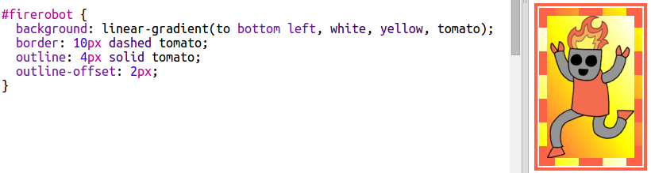

## Naljepnica Fantasy robota

Pomoću slike možete napraviti naljepnicu s gradijentom. Ako koristite sliku s prozirnom pozadinom, tada će se gradijent prikazati.

Također možete stvoriti gradijente za pokretanje u različitim smjerovima.

+ Dodaj naljepnicu na `index.html` pomoću slike `firerobot.png`:
    
    
    
    Možete podesiti `visinu` da biste promijenili veličinu slike, širina će se automatski promijeniti.

+ Normalno linearni gradijent traje od vrha do dna, ali možete upotrijebiti `do` da biste promijenili smjer. Na primjer: `na vrh`, `na lijevu stranu`ili `na desno`.
    
    Za dijagonalni gradijent dajete dva smjera. Ovaj primjer upotrebljava `dolje lijevo`.
    
    Dodajte ovaj stil u `style.css` da biste novu robotsku naljepnicu dijagonalni gradijent i lijepu granicu:
    
    
    
    Napominjemo da možete upotrijebiti `obris` da biste izradili drugi granični okvir izvan uobičajenog. `obrisni offset` daje prazninu između obruba i obrisa.

+ Dodajmo neki tekst na ovu naljepnicu.
    
    Dodaj `` koji sadrži tekst "ROBOTS" na `index.html` i dajte joj id.
    
    

+ Tekst će izgledati bolje ako ga povećate i položite ga.
    
    Da biste postavili tekst, morat ćete dodati `poziciju: relativno;` do `#greensticker` i `pozicija: apsolutni` do `#greentext`. Pozicioniranje je detaljnije opisano u projektu `Build a Robot`.
    
    Dodajte sljedeći kod `style.css`:
    
    

+ A za konačni uvijar, zakrenite tekst pomoću `transformacije: zakreni`.
    
    
    
    Pokušajte promijeniti broj stupnjeva koje je tekst rotiran.