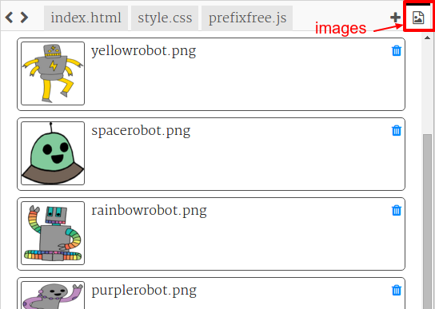
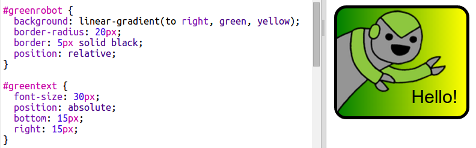

\--- challenge \---

## Izazov: Napravite više naljepnica

Sada pokušajte izraditi više naljepnica pomoću različitih smjerova gradijenta i dodavanjem slika i teksta te korištenjem granica i obrisa.

Savjet: za svaku naljepnicu morat ćete dodati HTML i CSS.

Možete kopirati i urediti jedan od primjera i napraviti izmjene kako biste stvorili novu naljepnicu.

Vaš projekt već uključuje skup robota. Kliknite ikonu slika da biste vidjeli dostupne slike.

Ovaj primjer koristi linearni gradijent s `na desno`:

\--- /challenge \---