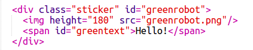

--- challenge ---
## Sfida: Realizza altri adesivi

Ora prova a realizzare altri adesivi utilizzando altre direzioni del gradiente, aggiungendo immagini e testo e impiegando bordi e contorni.

Suggerimento: dovrai aggiungere HTML e CSS per ogni adesivo.

Puoi copiare e modificare uno degli esempi e fare cambiamenti per creare un nuovo adesivo.

Il tuo progetto include già una serie di immagini con i robot. Fai clic sull'icona delle immagini per vedere le immagini disponibili.

In questo esempio è utilizzato un gradiente con `to right` (a destra):

--- /challenge ---