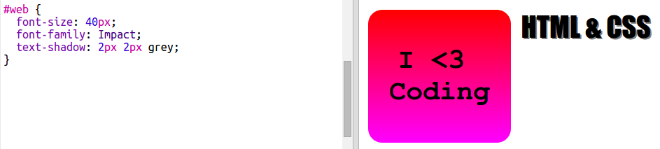

## HTML & CSSステッカー

グラデーションは、中心からエッジに向かって色を変えることもできます。これは放射グラデーションと呼ばれます。

+ テキスト `HTML & CSSでステッカーを作成しましょう。` `&` は、HTMLでエンコーディングする必要がある別の文字です。コードは `&ampです。`。
    
    強調表示されたコードを追加して、新しいステッカーを作成します。
    
    

+ 次に、 `style.css` ファイルに切り替えて、新しいステッカーのスタイルを追加します。
    
    
    
    `テキストシャドー` コードは、テキストの下と右に2ピクセル伸びるシャドウを追加して、目立たせます。

+ 今度はグラデーションのために。今回は、放射状のグラデーションを使用しましょう。色は中央の黄色からオレンジ色、そして赤色に変化します。
    
    
    
    グラデーションには2つだけでなく複数の色が含まれることに注意してください。

+ ステッカーは、いくつかのパディングと丸みを帯びたボーダーで、はるかに良く見えます。
    
    強調表示されたコードを追加：
    
    