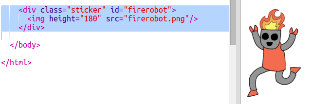

## ファンシーロボットステッカー

イメージを使ってグラデーションステッカーを作ることができます。背景が透明な画像を使用すると、グラデーションが表示されます。

グラデーションを作成して、異なる方向に実行することもできます。

+ ステッカーを追加 `index.htmlを` 使用して `firerobot.png` 画像を：
    
    
    
    `高さ` を調整して画像のサイズを変更すると、幅が自動的に変更されます。

+ 通常、線形勾配は、上から下に実行されますが、あなたは使用することができます `への` 方向を変化させます。たとえば、次の `トップに`、 `左`、又は `右に`。
    
    斜めのグラデーションでは、2つの方向を指定します。この例では、 `を左下`ます。
    
    このスタイルを `style.css` に追加して、新しいロボットステッカーに斜めのグラデーションと派手なボーダーを与えます：
    
    
    
    `アウトライン` を使用して通常のアウトラインの外に別のボーダーを作成することができます。 `outline-offset` は、境界線とアウトラインの間のギャップを示します。

+ このステッカーにテキストを追加しましょう。
    
    テキスト "ROBOTS"を含む `` を `index.html` 追加し、それにidを与えます。
    
    

+ テキストを大きくして配置すると、テキストがより見やすくなります。
    
    テキストを配置するには、 `位置を追加する必要があります：相対;` へ `#greensticker` 及び `位：絶対` へ `#greentext`。 位置付けの詳細については、 `Robot` プロジェクトのビルドを参照してください。
    
    次のコードを `追加します。style.css`：
    
    

+ 最終的なひねりのために、 `変換を使用してテキストを回転させましょう：`回転させます。
    
    
    
    テキストを回転させる度合いを変更してみてください。