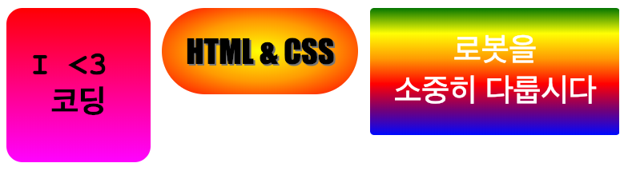

## 소개

이 프로젝트에서는 웹 페이지를 꾸미기 위해 사용할 수 있는 재미있는 스티커를 많이 만듭니다. 점차적으로 한 색상에서 다른 색상으로 변경되는 그라데이션을 사용하여 스티커를 멋지게 꾸밀 수 있습니다.

### 교육자들을 위한 추가 정보

이 프로젝트를 인쇄하려면 [프린트용 문서](https://projects.raspberrypi.org/en/projects/stickers/print)를 사용하십시오.

## \--- collapse \---

## title: 교육자 노트

## 소개

이 프로젝트에서 학생들은 CSS의 선형 및 방사형 그라데이션에 대해 배웁니다. 학생들은 또한 보더와 포지셔닝의 개념에 대해 더 배울 것입니다.

## 온라인 자료들

이 자료에서는 HTML과 CSS를 온라인으로 작성 가능한 [trinket](https://trinket.io/)을 사용하는 것을 권장합니다. 이 프로젝트는 아래와 같은 Trinket을 사용합니다:

* ['스티커'시작 지점 - jumpto.cc/web-stickers](http://jumpto.cc/web-stickers)

학생들은 새로운 Trinket[(jumpto.cc/html-black)](http://jumpto.cc/html-blank)을 사용할 수 있으며, 이를 통해 자신만의 HTML & CSS 코드를 작성하는 법을 배울 수 있습니다. 또한, 템플릿이 제공되어 있는 Trinket을 사용할 수 있습니다. [(jumpto.cc/html-template)](http://jumpto.cc/html-template).

프로젝트의 샘플 정답이 다음 Trinket에 있습니다.

* ['스티커'완료 - trinket.io/html/bb4e538e0a](https://trinket.io/html/bb4e538e0a)

## 오프라인 자료들

여러분의 선호에 따라 프로젝트를 [오프라인에서 완성](https://www.codeclubprojects.org/en-GB/resources/webdev-working-offline/)할 수 있습니다. 'Project Materials' 라는 링크를 클릭하여 이 프로젝트의 자료를 확인해볼 수 있습니다. 이 링크에는 학생들이 프로젝트를 오프라인으로 완료하는 데 필요한 자료가 포함된 'Project Resource' 섹션이 있습니다. 학생들이 이러한 자료의 사본에 접근할 수 있는지 확인하십시오. 이 섹션에는 아래와 같은 파일들이 포함되어 있습니다.

* intro/index.html
* template/template.html
* template/style.css
* stickers/index.html
* stickers/style.css
* stickers/script.js
* stickers/robot .png images

이 프로젝트의 완성된 버전은 'Volunteer Resources' 섹션에서 찾을 수 있습니다. 다음 파일이 있습니다:

* stickers-finished/index.html
* stickers-finished/style.css
* stickers-finished/script.js
* 스티커 마감 / 로봇 .png 이미지

(또한 위의 모든 자료는 프로젝트 및 자원봉사자 `.zip` 파일로 다운로드 할 수 있습니다.)

## 학습 목표

* 이 프로젝트는 CSS 그라데이션을 사용하여 재미있는 효과를 만들어냅니다. 학생들은 CSS 경계와 위치에 대한 지식을 넓힐 것입니다. 

이 프로젝트는 [라즈베리파이 디지털 메이킹 커리큘럼](http://rpf.io/curriculum) 중 아래의 과정에 있는 요소들을 다룹니다.

* [2D와 3D 디자인](https://www.raspberrypi.org/curriculum/design/creator)

## 도전과제

* "자신의 그라디언트 스티커 만들기"- 텍스트에 선형 및 방사형 그래디언트 추가.
* "스티커를 더 만들자!" - 그라디언트를 이미지 및 텍스트와 결합하여 더 많은 스티커를 만듭니다.

\--- /collapse \---

## \--- collapse \---

## title: 프로젝트 자료

## 프로젝트 리소스

* [프로젝트의 모든 리소스가 들어있는 .zip 파일](resources/stickers-project-resources.zip)
* [인트로 프로젝트 자료가 포함된 온라인 Trinket](http://jumpto.cc/web-intro)
* [스티커 프로젝트 자료가 포함된 온라인 Trinket](http://jumpto.cc/web-stickers)
* [온라인 Trinket 템플릿](http://jumpto.cc/trinket-template)
* [빈 Trinket](http://jumpto.cc/trinket-blank)
* [template/index.html](resources/template-index.html)
* [template/style.css](resources/template-style.css)
* [stickers/index.html](resources/stickers-index.html)
* [stickers/style.css](resources/stickers-style.css)
* [stickers/prefixfree.js](resources/stickers-prefixfree.js)
* [stickers/bluerobot.png](resources/stickers-bluerobot.png)
* [stickers/firerobot.png](resources/stickers-firerobot.png)
* [stickers/purplerobot.png](resources/stickers-purplerobot.png)
* [stickers/spacerobot.png](resources/stickers-spacerobot.png)
* [stickers/dogrobot.png](resources/stickers-dogrobot.png)
* [stickers/greenrobot.png](resources/stickers-greenrobot.png)
* [stickers/rainbowrobot.png](resources/stickers-rainbowrobot.png)
* [stickers/yellowrobot.png](resources/stickers-yellowrobot.png)

## 교육자를 위한 자료

* [완성된 모든 프로젝트 리소스가 들어있는 .zip 파일](resources/stickers-volunteer-resources.zip)
* [완성된 온라인 Trinket 프로젝트](https://trinket.io/html/bb4e538e0a)
* [stickers-finished/index.html](resources/stickers-finished-index.html)
* [stickers-finished/style.css](resources/stickers-finished-style.css)
* [stickers-finished/prefixfree.js](resources/stickers-finished-prefixfree.js)
* [stickers-finished/bluerobot.png](resources/stickers-finished-bluerobot.png)
* [stickers-finished/firerobot.png](resources/stickers-finished-firerobot.png)
* [stickers-finished/purplerobot.png](resources/stickers-finished-purplerobot.png)
* [stickers-finished/spacerobot.png](resources/stickers-finished-spacerobot.png)
* [stickers-finished/dogrobot.png](resources/stickers-finished-dogrobot.png)
* [stickers-finished/greenrobot.png](resources/stickers-finished-greenrobot.png)
* [stickers-finished/rainbowrobot.png](resources/stickers-finished-rainbowrobot.png)
* [stickers-finished/yellowrobot.png](resources/stickers-finished-yellowrobot.png)

\--- /collapse \---