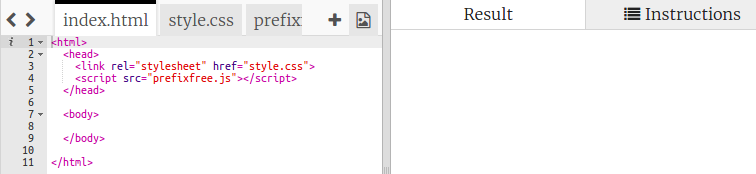
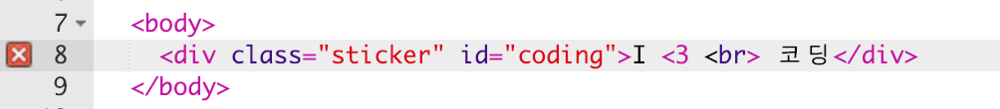
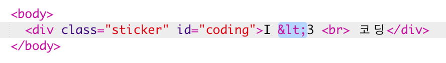
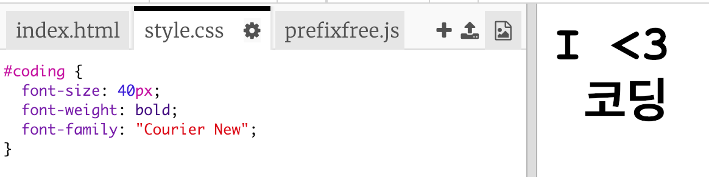
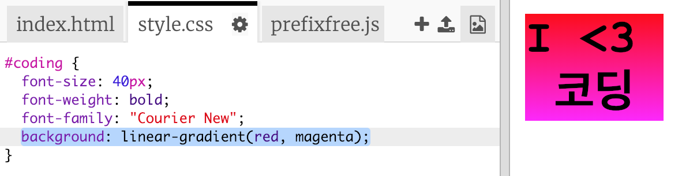
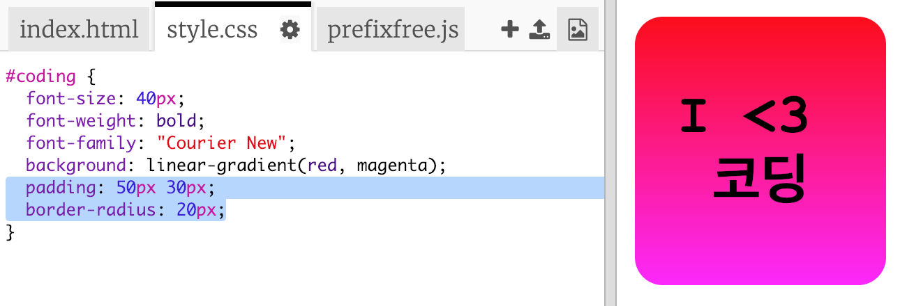

## 다채로운 코딩 스티커

그라데이션은 한 색상에서 다른 색상으로 점진적으로 변경된다는 특징을 가지고 있습니다. 여러분은 그라데이션를 사용하여 멋진 효과를 만들 수 있습니다. 여러분이 웹 페이지에서 사용할 수 있는 스티커를 만들기 위해 그라데이션를 사용할 것입니다.

+ 다음 Trinket 파일을 열어주세요. <a href="http://jumpto.cc/web-stickers" target="_blank">jumpto.cc/web-stickers</a>.
    
    Trinket을 열면 아래와 같은 프로젝트가 보일 것입니다.
    
    

+ I <3 코딩을 만들어 봅시다.g' sticker.
    
    스타일을 입힐 수 있도록 `
` 내 `sticker` 클래스, `coding` id를 지정합니다:
    
    

+ 흠, 뭔가 코드에 오류가 있다는 것이 느껴지나요? 왜냐하면 '<' 는 HTML의 예약된 문자이기 때문입니다. '<' 대신에 특수 코드인 `&lt;` 을 사용해야 합니다.
    
    코드를 `&lt;` 로 수정하여 오류가 사라지도록 하십시오.
    
    
    
    ` ` 태그는 줄바꿈 기능을 가지고 있는 태그입니다.

+ 이제, 스티커를 재미있게 만들어 봅시다.
    
    `style.css` 파일을 보시면, `.sticker` 클래스가 사진과 같이 제공되어 있는 것을 볼 수 있습니다. 이 클래스는 페이지 내 스티커의 레이아웃을 배치하고 내용이 가운데에 배치되도록 하는 역할을 합니다.
    
    다시 한번 스티커에 `coding`을 추가했는지 확인하세요. `style.css` 하단에 아래와 같은 코드를 추가하여 텍스트를 스타일링할 수 있도록 합니다:
    
    

+ 이제, 스티커의 배경에 그라디언트를 추가해 보도록 하겠습니다. 한 색상에서 다른 색상으로 변경되는 선형 그라데이션을 추가해 보겠습니다.
    
    아래와 같이 이 그라데이션는 위쪽의 빨간색에서 아래쪽의 자홍색으로 스타일을 바꿉니다. 아래와 같이 그라디언트 코드를 `coding` 스타일에 반영합니다:
    
    

+ 패딩과 둥근 모서리를 추가하여 더 멋지게 만들 수 있을 것입니다.
    
    아래에 표시한 코드를 추가하세요.
    
    
    
    `padding` 스타일 옵션은 위쪽과 아래쪽에는 50px, 왼쪽과 오른쪽에는 30px의 패딩을 추가합니다.