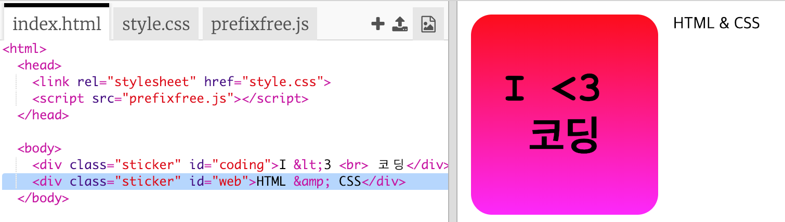
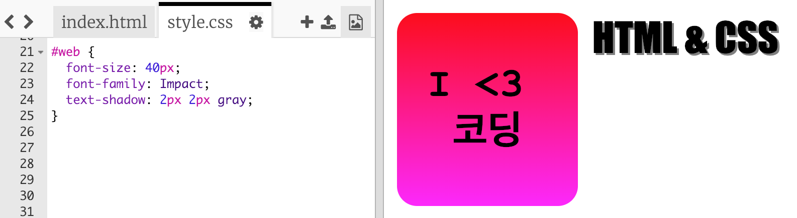
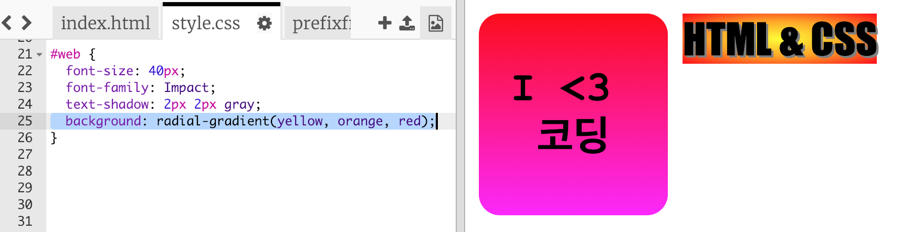
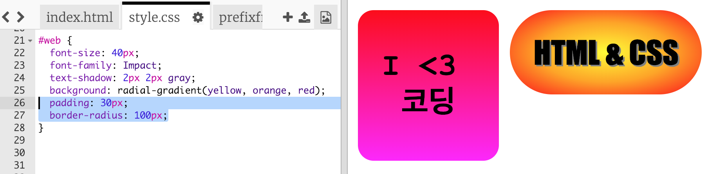

## HTML 및 CSS 스티커

그라데이션는 가운데에서 가장자리 쪽으로 색상을 변경할 수도 있는데, 이를 방사형 그라데이션라고 합니다.

+ `HTML & CSS` 라는 글자로 스티커를 만들어 봅시다. `&` 또한 HTML에서 예약된 문자로, 코드에는 `&amp;` 라고 기술해 주어야 합니다.
    
    아래와 같이 파란색으로 되어 있는 코드를 추가하여 새 스티커를 만듭니다.
    
    

+ 이제 `style.css` 파일로 전환하여 새 스티커에 스타일을 추가하세요.
    
    
    
    `text-shadow`는 텍스트가 눈에 잘 띄도록 텍스트의 아래쪽과 오른쪽으로 2px씩 확장되는 그림자를 추가합니다.

+ 이제 방사형 그라데이션을 사용해 봅시다. 색깔이 가운데 노란색에서 가장자리 빨간색, 주황색으로 바뀔 것입니다.
    
    
    
    그라데이션은 꼭 두 가지 색상만 가능한 것이 아닌, 여러 가지 색상도 사용할 수 있습니다.

+ 아래와 같이 패딩과 둥근 테두리를 설정하면 훨씬 더 보기 좋은 스티커가 나오네요.
    
    아래에 표시한 코드를 추가하세요.
    
    