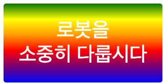

\--- challenge \---

## 과제 : 직접 그라디언트 스티커 만들기

이제 직접 자신만의 그라데이션 스티커를 만들어 봅시다. 선형 그라데이션와 방사형 그라데이션을 제작해 보세요.

아래와 같은 작업이 필요합니다:

+ 스타일을 입힐 수 있도록 `index.html` 내 텍스트가 들어 있는 `
` 안 `sticker` 클래스, `id` 를 지정합니다.
+ `style.css`에서 해당 `id` 에 대한 스타일을 추가하십시오. 이미 만든 스티커 스타일 중 하나를 복사하여 편집해도 됩니다. 

[jumpto.cc/web-colours](http://jumpto.cc/web-colours) 페이지에서 색상명을 알 수 있습니다. 여기서는 `tomato`, `firebrick`, `peachpuff` 등의 색상명도 찾을 수 있습니다.

텍스트 색상을 변경하려면 `color:` 내용을 변경합니다.

아래와 같이 선형 그라데이션를 사용해서 스티커를 만들 수 있습니다.

\--- /challenge \---