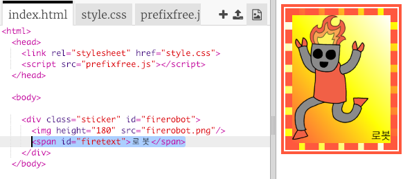
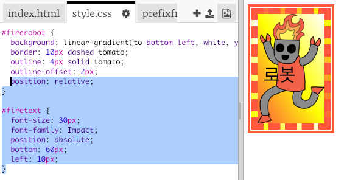
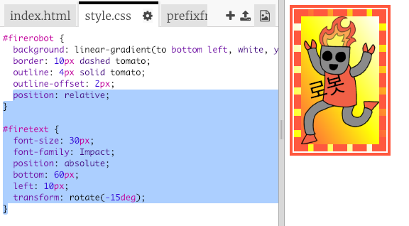

## 멋진 로봇 스티커

이미지를 사용하여 그라데이션 스티커를 만들 수 있습니다. 투명한 배경으로 이미지를 사용하면 그라데이션이 보입니다.

그라데이션을 다른 방향으로도 만들 수 있습니다.

+ `index.html` 파일 내 `firerobot.png` 이미지를 기반으로 한 스티커를 추가합니다:
    
    
    
    `height` 를 조정하여 이미지의 크기를 조정할 수 있으며 너비가 자동으로 변경됩니다.

+ 일반적으로 선형 그라데이션는 위에서 아래 방향으로 표현되지만, `to` 를 사용하여 방향을 바꿀 수 있습니다. 예를 들어: `to top`, `to left`, `to right` 등 활용이 가능합니다.
    
    대각선 그라데이션의 경우에는 두 방향을 제공하는데, 이 예제에서는 `to bottom left` 를 사용합니다.
    
    아래 스타일을 `style.css` 에 추가하여 오른쪽과 같이 스티커에 대각선 그라데이션와 멋진 테두리를 추가합니다.
    
    
    
    `outline`을 사용하여 바깥에 테두리를 만들 수 있습니다. `outline-offset`을 사용하여 테두리와 안쪽 스티커의 간격을 둘 수 있습니다.

+ 이 스티커에 텍스트를 추가해 봅시다.
    
    `index.html` 에 "로봇" 텍스트가 포함된 ``을 추가하여, id를 부여합니다.
    
    

+ 텍스트를 더 크게 만들고 위치를 지정해 주면 더 잘 보일 것입니다.
    
    텍스트 위치를 지정하려면 `#greensticker`에 `position: relative;`, `#greentext`에 `position: absolute`를 추가합니다. 텍스트 위치 지정에 관련된 내용은 `로봇 만들기` 프로젝트를 참고하시기 바랍니다.
    
    다음 코드를 `style.css`에 추가하십시오:
    
    

+ 마지막으로 글씨를 회전하기 위해 아래와 같이 `transform: rotate`을 사용합니다.
    
    
    
    텍스트가 회전되는 각도를 변경해 보세요.