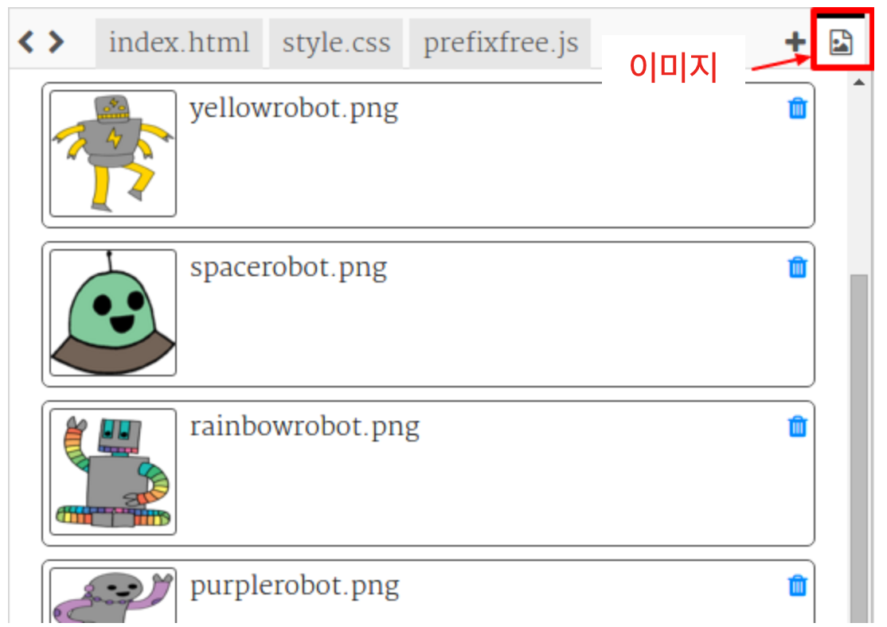
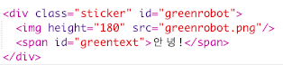
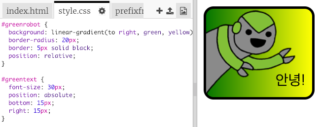

--- challenge ---

## 과제 : 더 많은 스티커 만들기

이제 다양한 그라데이션을 사용하여 더 많은 스티커를 만들고, 이미지와 텍스트를 추가하고, 테두리와 윤곽선을 사용해 보세요.

힌트: 각 스티커에 HTML과 CSS를 추가해야합니다.

지금까지 소개되었던 예제 중 하나를 복사, 편집하고 변경하여 새로운 스티커를 만들 수 있습니다.

프로젝트에 이미 로봇 이미지가 포함되어 있습니다. 사용 가능한 이미지를 보려면 이미지 아이콘을 클릭하세요.

이 예제에서는 `to right` 옵션이 지정된 선형 그라데이션을 사용합니다.

--- /challenge ---

커뮤니티 기여 번역

이 프로젝트는 강태원 가 번역하였고 한성진 가 검토하였습니다.

우리의 놀라운 번역 자원 봉사자들은 전 세계의 어린이들에게 코딩을 배울 수 있는 기회를 제공합니다. 우리 프로젝트 번역에 참여하여 더 많은 아이들에게 도움을 줄 수 있습니다. 자세한 내용은 [rpf.io/translators](https://rpf.io/translators)에서 확인하세요.