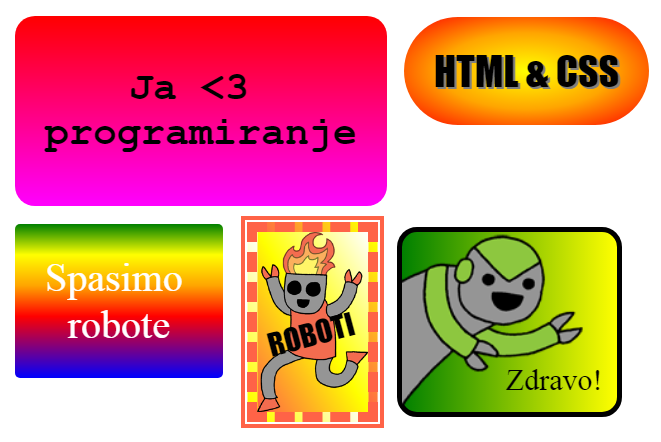

## Uvod

U ovom projektu napravićeš mnogo zabavnih naljepnica koje možeš koristiti za ukrašavanje veb-stranica. Naučićeš da koristiš gradijente koji postepeno prelaze iz jedne boje u drugu, kako bi tvoje naljepnice sjajno izgledale.

### Dodatne informacije za vođe kluba

Ukoliko je potrebno da odštampate ovaj projekat, koristite [Verziju za štampu](https://projects.raspberrypi.org/me-ME/projects/stickers/print).

--- collapse ---
---
title: Bilješke za vođe kluba
---
## Uvod:

U ovom projektu djeca će se upoznati sa linearnim i radijalnim gradijentima u CSS-u. Takođe će više naučiti o okvirima i pozicioniranju.

## Online izvori

Za pisanje HTML-a i CSS-a online preporučujemo da koristite [trinket](https://trinket.io/). Ovaj projekat sadrži sljedeće trinkete:

* [Početak projekta 'Naljepnice!' -- jumpto.cc/web-stickers](http://jumpto.cc/web-stickers)

Za pisanje sopstvenog HTML-a i CSS-a, djeca takođe mogu da koriste ovaj prazan trinket [(jumpto.cc/html-blank)](http://jumpto.cc/html-blank) ili da koriste ovaj trinket šablon [(jumpto.cc/html-template)](http://jumpto.cc/html-template).

Takođe postoji trinket koji sadrži primjer rješenja izazova:

* [Završen projekat 'Naljepnice' -- trinket.io/html/4a6843dff3](https://trinket.io/html/4a6843dff3)

## Offline izvori

Ako želite, ovaj projekat može biti [izrađen offline](https://www.codeclubprojects.org/en-GB/resources/webdev-working-offline/). Izvorima projekta možete pristupiti klikom na link projekta 'Projektni materijali'. Navedeni link sadrži odjeljak 'Izvori projekta' u kojem se nalaze izvori koji će djeci biti potrebni kako bi izradila ovaj projekat offline. Obezbijedite da svako dijete ima pristup kopiji ovih izvora. Odjeljak sadrži sljedeće datoteke:

* intro/index.html
* template/template.html
* template/style.css
* stickers/index.html
* stickers/style.css
* stickers/script.js
* stickers/robot .png images

Takođe, završenu verziju izazova ovoga projekta možete naći u odjeljku 'Izvori za volontere' koji sadrži:

* stickers-finished/index.html
* stickers-finished/style.css
* stickers-finished/script.js
* stickers-finished/robot .png images

(Sve navedene izvore moguće je preuzeti kao `.zip` datoteke.)

## Ciljevi učenja

* U ovom projektu predstavljena je upotreba CSS gradijenata za kreiranje zanimljivih efekata. Učenici će takođe proširiti svoje znanje o CSS okvirima i pozicioniranju. 

Ovim projektom obuhvaćeni su elementi iz sljedećih dijelova [Raspberry Pi Digital Making Curriculum](http://rpf.io/curriculum):

* [Dizajniranje osnovnih 2D i 3D elemenata](https://www.raspberrypi.org/curriculum/design/creator).

## Izazovi

* ''Kreiraj svoju naljepnicu sa gradijentom'' - dodavanje linearnog i radijalnog gradijenta tekstu;
* ''Napravi više naljepnica!'' - kreiranje novih naljepnica kombinovanjem gradijenata sa slikama i tekstom.

--- /collapse ---

--- collapse ---
---
title: Projektni materijali
---
## Izvori projekta

* [.zip datoteka koja sadrži sve izvore projekta](resources/stickers-project-resources.zip)
* [Online Trinket koji sadrži sve izvore projekta 'Intro'](http://jumpto.cc/web-intro)
* [Online Trinket koji sadrži sve izvore projekta 'Naljepnice'](http://jumpto.cc/web-stickers)
* [Online Trinket šablon](http://jumpto.cc/trinket-template)
* [Online prazan Trinket](http://jumpto.cc/trinket-blank)
* [template/index.html](resources/template-index.html)
* [template/style.css](resources/template-style.css)
* [stickers/index.html](resources/stickers-index.html)
* [stickers/style.css](resources/stickers-style.css)
* [stickers/prefixfree.js](resources/stickers-prefixfree.js)
* [stickers/bluerobot.png](resources/stickers-bluerobot.png)
* [stickers/firerobot.png](resources/stickers-firerobot.png)
* [stickers/purplerobot.png](resources/stickers-purplerobot.png)
* [stickers/spacerobot.png](resources/stickers-spacerobot.png)
* [stickers/dogrobot.png](resources/stickers-dogrobot.png)
* [stickers/greenrobot.png](resources/stickers-greenrobot.png)
* [stickers/rainbowrobot.png](resources/stickers-rainbowrobot.png)
* [stickers/yellowrobot.png](resources/stickers-yellowrobot.png)

## Izvori za vođe kluba

* [.zip datoteka koja sadrži sve završene izvore projekta](resources/stickers-volunteer-resources.zip)
* [Završen Trinket projekat online](https://trinket.io/html/4a6843dff3)
* [stickers-finished/index.html](resources/stickers-finished-index.html)
* [stickers-finished/style.css](resources/stickers-finished-style.css)
* [stickers-finished/prefixfree.js](resources/stickers-finished-prefixfree.js)
* [stickers-finished/bluerobot.png](resources/stickers-finished-bluerobot.png)
* [stickers-finished/firerobot.png](resources/stickers-finished-firerobot.png)
* [stickers-finished/purplerobot.png](resources/stickers-finished-purplerobot.png)
* [stickers-finished/spacerobot.png](resources/stickers-finished-spacerobot.png)
* [stickers-finished/dogrobot.png](resources/stickers-finished-dogrobot.png)
* [stickers-finished/greenrobot.png](resources/stickers-finished-greenrobot.png)
* [stickers-finished/rainbowrobot.png](resources/stickers-finished-rainbowrobot.png)
* [stickers-finished/yellowrobot.png](resources/stickers-finished-yellowrobot.png)

--- /collapse ---