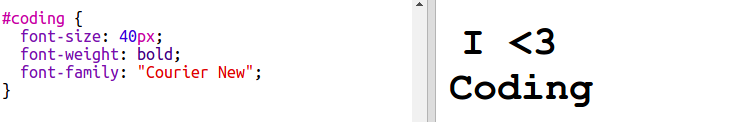

## Naljepnica o programiranju u više boja

Gradijent je postepeni prelaz iz jedne boje u drugu. Gradijenti mogu da se koriste za stvaranje zanimljivih efekata. Koristićeš ih za izradu naljepnica koje možeš da upotrijebiš na svojim veb-stranicama.

+ Otvori sljedeći trinket: <a href="http://jumpto.cc/web-stickers" target="_blank">jumpto.cc/web-stickers</a>.
    
    Projekat treba da izgleda ovako:
    
    

+ Napravimo naljepnicu 'Ja <3 programiranje'. g' sticker.
    
    Koristi `
` sa klasom `sticker` i id `programiranje` da bi mogao/mogla da je stilizuješ:
    
    

+ Hm, primjećuješ li da se desila greška? To se desilo zato što je '<' poseban znak u HTML-u. Umjesto znaka '<' treba da koristiš poseban kôd `&lt;`.
    
    Izmijeni svoj kôd i upotrijebi `&lt;` kako bi greška bila otklonjena.
    
    
    
    Oznaka ` ` koristi se za prelazak u novi red.

+ Napravimo sada da naljepnica izgleda zanimljivo.
    
    Pređi na `style.css` datoteku. Vidjećeš da je za tebe već kreirana klasa `.sticker`. Ona služi za raspoređivanje naljepnica na stranici i centriranje njihovog sadržaja.
    
    Sjeti se da si svojoj naljepnici dodao/dodala id `programiranje`. Na kraju `style.css` dodaj sljedeći kôd za stilizovanje teksta:
    
    

+ Sada možeš da dodaš gradijent za pozadinu naljepnice. Linearni gradijent prelazi iz jedne boje u drugu duž prave linije.
    
    Ovaj gradijent će se promijeniti od crvene boje na vrhu do purpurne na dnu. Dodaj kôd gradijenta svom stilu `programiranje`:
    
    

+ Rezultat možeš da poboljšaš dodavanjem popune (padding) i zaobljenih uglova.
    
    Dodaj označeni kôd:
    
    
    
    Stil `padding` dodaje popunu od 50 px na vrhu i dnu i 30 px na lijevoj i desnoj strani.