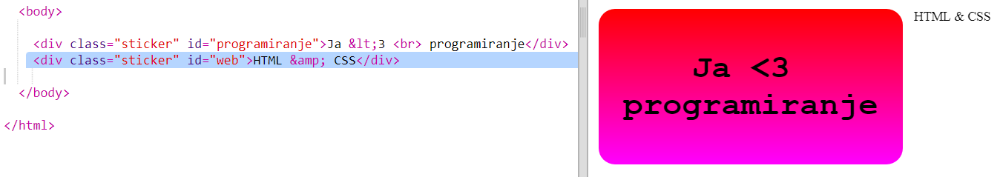
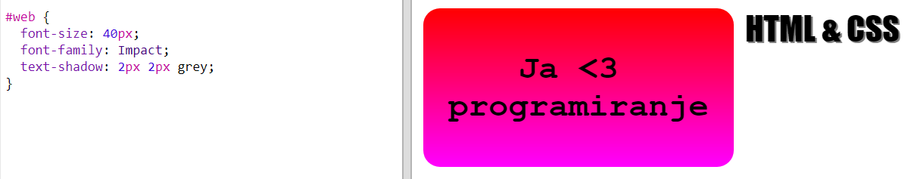
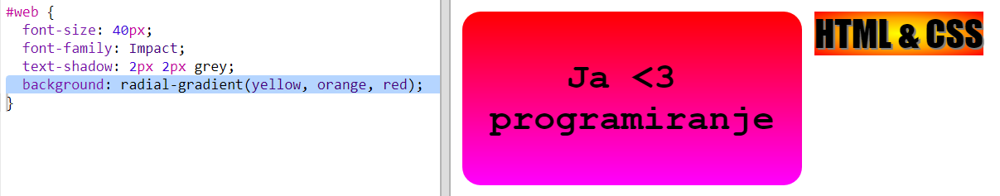
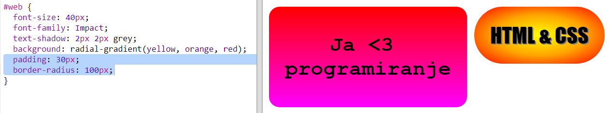

## HTML & CSS naljepnica

Gradijenti takođe mogu da mijenjaju boju od sredine prema krajevima. Takav gradijent zove se radijalni gradijent.

+ Napravimo naljepnicu sa tekstom `HTML & CSS`. Znak `&` je još jedan znak koji je potrebno kodirati u HTML-u, a kôd je `&amp;`.
    
    Dodaj označeni kôd da napraviš novu naljepnicu:
    
    

+ Sada pređi na `style.css` datoteku i dodaj stil za svoju novu naljepnicu:
    
    
    
    Kôd `text-shadow` dodaje sjenku koja se proteže 2 px ispod i desno od teksta i ističe tekst.

+ Sada pređimo na gradijent. Ovaj put koristićemo radijalni gradijent. Boja će se mijenjati od žute u sredini, preko narandžaste do crvene.
    
    
    
    Imaj u vidu da gradijenti mogu da sadrže više boja, ne samo dvije.

+ Naljepnica će mnogo bolje izgledati sa malo popune i sa zaobljenim uglovima.
    
    Dodaj označeni kôd:
    
    