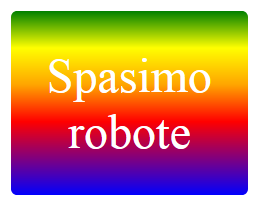

\--- challenge \---

## Izazov: Kreiraj svoju naljepnicu sa gradijentom

Sada napravi svoju naljepnicu sa gradijentom. Isprobaj linearni i radijalni gradijent koristeći više HTML boja.

Biće potrebno da:

+ Dodaš `
` sa tekstom svoje naljepnice u `index.html` i dodijeliš mu klasu `sticker` i novi `id`.
+ Dodaš stil koji si odabrao/odabrala za `id` u `stile.css`. Možeš da kopiraš jedan od stilova naljepnice koji si već napravio/napravila i da ga preurediš. 

Ovdje se nalazi spisak svih naziva boja koje možeš koristiti: [jumpto.cc/web-colours](http://jumpto.cc/web-colours). Ovaj spisak sadrži nazive boja kao što su `tomato` (paradajz), `firebrick` (cigla) i `peachpuff` (breskva).

Ako želiš da promijeniš boju teksta, možeš da koristiš `color:`.

Evo primjera koji pokazuje šta možeš da uradiš sa različitim bojama u linearnom gradijentu:

\--- /challenge \---