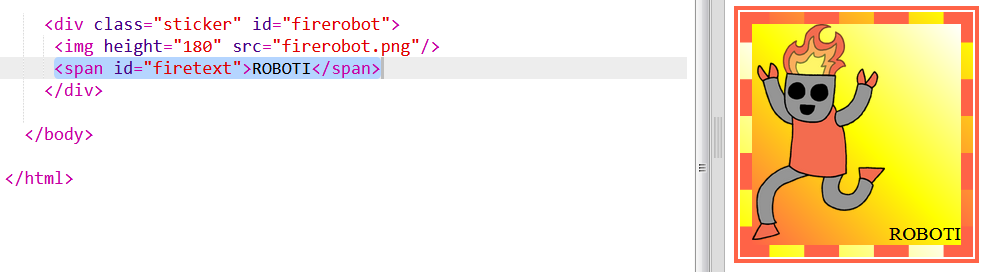
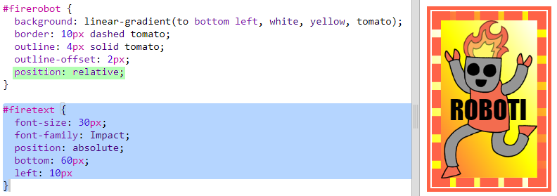
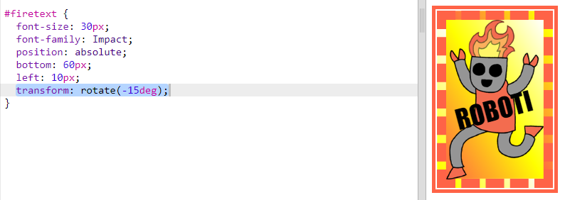

## Ukrašena naljepnica sa robotom

Možeš da napraviš naljepnicu sa gradijentom koristeći sliku. Ako koristiš sliku sa prozirnom pozadinom, gradijent će se prikazati preko pozadine.

Možeš da napraviš i gradijente usmjerene u različitim pravcima.

+ Dodaj naljepnicu u `index.html` koristeći sliku `firerobot.png`:
    
    
    
    Možeš da podesiš `height` (visinu) da promijeniš veličinu slike, a širina će se automatski promijeniti.

+ Linearni gradijent obično je usmjeren od vrha prema dnu, ali možeš da koristiš `to` za promjenu smjera. Na primjer: `to top` (prema vrhu), `to left` (ulijevo) ili `to right` (udesno).
    
    Za dijagonalni gradijent zadaješ dva smjera. U ovom primjeru upotrebljava se `to bottom left` (prema donjem lijevom uglu).
    
    Dodaj sljedeći stil u `style.css` da svojoj novoj naljepnici sa robotom daš dijagonalni gradijent i ukrasni okvir:
    
    
    
    Imaj u vidu da izvan običnog okvira možeš da napraviš još jedan okvir, koristeći `outline` (konturu). Sa `outline-offset` definiše se razmak između okvira i konture.

+ Dodajmo naljepnici neki tekst.
    
    Dodaj `` koji sadrži tekst ''ROBOTI'' u `index.html` i dodijeli mu id.
    
    

+ Tekst će izgledati bolje ako ga povećaš i pozicioniraš.
    
    Za pozicioniranje teksta treba da dodaš `position: relative;` u `#greensticker` i `position: absolute` u `#greentext`. Pozicioniranje je detaljnije objašnjeno u projektu `Konstruiši robota`.
    
    Dodaj sljedeći kôd u `style.css`:
    
    

+ Na kraju, rotirajmo tekst koristeći `transform: rotate`.
    
    
    
    Pokušaj da promijeniš broj stepeni za rotaciju teksta.