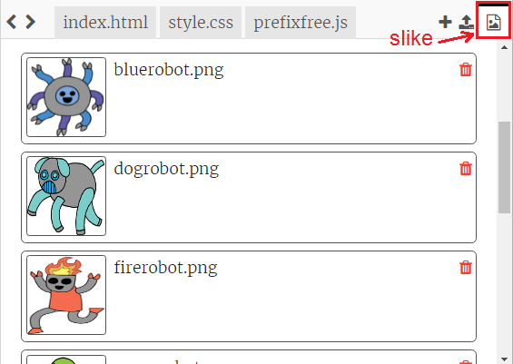
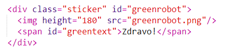
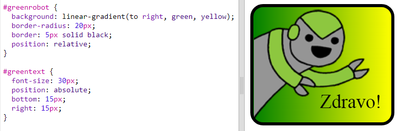

--- challenge ---

## Izazov: Napravi više naljepnica

Sada pokušaj da napraviš još naljepnica, koristeći različite smjerove gradijenta, dodajući slike i tekst i koristeći okvire i konture.

Savjet: Biće potrebno da dodaš HTML i CSS za svaku naljepnicu.

Možeš da kopiraš i urediš jedan od svojih primjera i da uneseš izmjene kako bi napravio/napravila novu naljepnicu.

Tvoj projekat već sadrži zbirku slika robota. Klikni na ikonu za slike da pregledaš dostupne slike.

U ovom primjeru korišćen je linearni gradijent sa `to right` (udesno):

--- /challenge ---