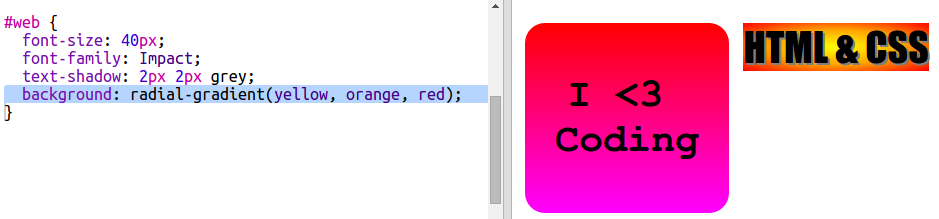

## HTML & CSS स्टिकर्स

ग्रेडियंट्स मध्यभागा पासुन कडांकडे रंग बदलू शकतो, याला रेडियल ग्रेडियंट (radial gradient) म्हणतात.

+ चला मग आत्ता `HTML &  CSS` सोबत स्टिकर बनवुया.`&` हा अजुन एक वर्ण (character) आहे ज्याला एन्कोडिंग ची गरज आहे.आणी त्याचा कोड आहे `&amp;`.
    
    नवीन स्टिकर तयार करण्यासाठी हायलाइट केलेला कोड जोडा:
    
    

+ आता आपल्या `style.css` वर स्विच करा आपल्या नवीन स्टिकरसाठी फाइल जोडा आणि एक शैली (style) जोडा:
    
    
    
    `text-shadow` कोड एक shadow जोडतो जो स्पष्ट करण्यासाठी मजकूरच्या खाली आणि उजवीकडे 2px वाढवितो.

+ ग्रेडियंटसाठी आता यावेळी आपण रेडियल ग्रेडियंट वापरू. याचा रंग मध्यभागी पिवळ्या ते केशरी आणि नंतर लाल रंगात बदलेल.
    
    
    
    लक्षात घ्या की ग्रेडियंटमध्ये फक्त दोनच नाही तर अनेक रंगांचा समावेश असू शकतो.

+ काही पॅडिंग(padding) आणि गोलाकार सीमेसह(rounded corner) स्टिकर अधिक चांगले दिसेल.
    
    हायलाइट केलेला कोड जोडा:
    
    