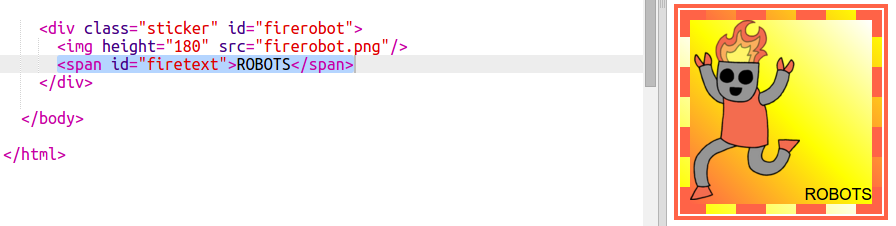

## आकर्षक रोबोट स्टिकर्स

ग्रेडियंट स्टिकर बनवण्यासाठी आपण इमेज(image) चा वापर करु शकता. जर आपण पारदर्शक पार्श्वभूमी असलेली इमेज वापरत असाल तर ग्रेडियंट त्यामधून दिसून येईल.

आपण वेगवेगळ्या दिशांमध्ये धावण्यासाठी ग्रेडियंट देखील तयार करू शकता.

+ `firerobot.png` इमेज वापरून `index.html` मध्ये स्टिकर जोडा:
    
    
    
    इमेजचे आकार बदलण्यासाठी आपण `height` समायोजित(adjust) करू शकता, रुंदी आपोआप बदलेल.

+ सामान्यत: एक रेषीय ग्रेडियंट वरपासून खालपर्यंत चालतो, परंतु आपण दिशा बदलण्यासाठी `to` या टॅग चा उपयोग करू शकतो. उदाहरणार्थ: `to top` (शीर्षस्थानी), `to left` (डावीकडून), किंवा `to right` (उजवीकडे).
    
    कर्ण (diagonal) ग्रेडियंटसाठी आपण दोन दिशानिर्देश द्या. हे उदाहरण खाली डावीकडे `to bottom left` वापरते.
    
    तुमच्या रोबोट स्टिकरला कर्ण(diagonal) ग्रेडियंट देण्यासाठी आणि त्याच्या बोर्डर अजून आकर्षक बनवण्यासाठी हि शैली `style.css` ला जोडा:
    
    
    
    लक्षात घ्या की आपण नेहमीच्या बाहेर एक सीमा तयार करण्यासाठी `outline` वापरू शकता. बोर्डर आणि बाह्यरेखा (outline) दरम्यानचे अंतर देते `outline-offset` देते.

+ चला आता या स्टिकरमध्ये काही मजकूर जोडूया.
    
    "ROBOTS" असा मजकूर `` मध्ये आणि मग `index.html` ला जोडा आणि त्याला id द्या.
    
    

+ आपण मजकूर मोठा बनवल्यास आणि त्यास ऊचित जागा दिल्यास ते अधिक चांगले दिसेल.
    
    मजकूर स्थितीत ठेवण्यासाठी आपल्याला `position: relative` ला `#greensticker` मध्ये आणि `position: absolute` ला `#greentext` मध्ये जोडावे लागेल. पोझिशनिंग अधिक तपशिलवार पणे `रोबोट बनवा` मध्ये समजवलेले आहे.
    
    खालील कोड `style.css` मध्ये जोडा:
    
    

+ आता अंतिम वळणासाठी, चला मजकूराला `transform: rotate` वापरून पलटु.
    
    
    
    मजकूर फिरविला गेलेल्या अंशांची संख्या बदलण्याचा प्रयत्न करा.