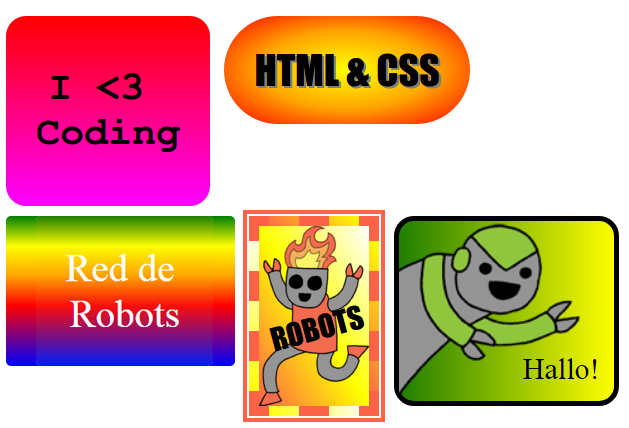

## Inleiding

In dit project maak je veel leuke stickers die je kunt gebruiken om webpagina's te versieren. Je leert verlopen te gebruiken, kleuren die geleidelijk van de ene in de andere overgaan, zodat je stickers er cool uitzien.

### Aanvullende informatie voor clubleiders

Als je dit project wilt afdrukken, gebruik dan de [Printervriendelijke versie](https://projects.raspberrypi.org/en/projects/stickers/print).

## \--- collapse \---

## title: Clubleider notities

## Inleiding:

In dit project maken kinderen kennis met lineaire en radiale kleurverlopen in CSS. Ze leren ook meer over randen en positionering.

## Online bronnen

We raden aan [ trinket ](https://trinket.io/) te gebruiken om online HTML & CSS te scrhijven. Dit project bevat de volgende trinkets:

* ['Stickers' startpunt - jumpto.cc/web-stickers](http://jumpto.cc/web-stickers)

Kinderen kunnen ook gebruik maken van deze lege trinket [(jumpto.cc/html-blank)](http://jumpto.cc/html-blank) om hun eigen HTML & CSS te schrijven, of ze kunnen deze sjabloon trinket [(jumpto.cc/html-template)](http://jumpto.cc/html-template) gebruiken.

Er is ook een voorbeeld trinket met een oplossing voor de uitdagingen:

* ['Stickers' gereed - trinket.io/html/bb4e538e0a](https://trinket.io/html/bb4e538e0a)

## Offline bronnen

This project can be [completed offline](https://rpf.io/html-offline) if preferred. Je kunt toegang krijgen tot de projectbronnen door op de koppeling 'Projectmaterialen' voor dit project te klikken. Deze link bevat een 'Projectbronnen'-sectie die bronnen bevat om dit project offline te voltooien. Zorg ervoor dat elk kind toegang heeft tot een kopie van deze bronnen. Dit gedeelte bevat de volgende bestanden:

* intro/index.html
* template/template.html
* template/style.css
* stickers/index.html
* stickers/style.css
* stickers/script.js
* stickers/robot .png images

Je kunt ook van de uitdagingen een voltooide versie van dit project vinden in de sectie 'Vrijwilligersbronnen', die bevat:

* stickers-finished/index.html
* stickers-finished/style.css
* stickers-finished/script.js
* stickers-finished/robot .png images

(Alle bovenstaande bronnen kunnen ook als project en als vrijwilliger `.zip` bestanden worden gedownload.)

## Leerdoelen

* Dit project introduceert het gebruik van CSS voor verlopen om interessante effecten te creëren. Studenten breiden ook hun kennis uit over CSS voor randen en positionering. 

This project covers elements from the following strands of the [Raspberry Pi Digital Making Curriculum](https://rpf.io/curriculum):

* [Ontwerp standaard 2D- en 3D-objecten](https://www.raspberrypi.org/curriculum/design/creator).

## Uitdagingen

* "Maak je eigen verloopsticker" - voeg lineaire en radiale verlopen toe aan tekst;
* "Maak meer stickers!" - Combineer verlopen met afbeeldingen en tekst om meer stickers te maken.

\--- /collapse \---

## \--- collapse \---

## title: Projectmaterialen

## Projectbronnen

* [.zip-bestand met alle projectbestanden](https://rpf.io/p/en/stickers-go)
* [Online Trinket met alle 'Intro' projectbestanden](http://jumpto.cc/web-intro)
* [Online Trinket met alle projectbestanden van 'Stickers'](http://jumpto.cc/web-stickers)
* [Online Trinket-sjabloon](http://jumpto.cc/trinket-template)
* [Online lege Trinket](http://jumpto.cc/trinket-blank)
* [template/index.html](resources/template-index.html)
* [template/style.css](resources/template-style.css)
* [stickers/index.html](resources/stickers-index.html)
* [stickers/style.css](resources/stickers-style.css)
* [stickers/prefixfree.js](resources/stickers-prefixfree.js)
* [stickers/bluerobot.png](resources/stickers-bluerobot.png)
* [stickers/firerobot.png](resources/stickers-firerobot.png)
* [stickers/purplerobot.png](resources/stickers-purplerobot.png)
* [stickers/spacerobot.png](resources/stickers-spacerobot.png)
* [stickers/dogrobot.png](resources/stickers-dogrobot.png)
* [stickers/greenrobot.png](resources/stickers-greenrobot.png)
* [stickers/rainbowrobot.png](resources/stickers-rainbowrobot.png)
* [stickers/yellowrobot.png](resources/stickers-yellowrobot.png)

## Clubleiderbronnen

* [.zip-bestand met alle voltooide projectbestanden](https://rpf.io/p/en/stickers-go)
* [Online voltooid Trinket-project](https://trinket.io/html/bb4e538e0a)
* [stickers-finished/index.html](resources/stickers-finished-index.html)
* [stickers-finished/style.css](resources/stickers-finished-style.css)
* [stickers-finished/prefixfree.js](resources/stickers-finished-prefixfree.js)
* [stickers-finished/bluerobot.png](resources/stickers-finished-bluerobot.png)
* [stickers-finished/firerobot.png](resources/stickers-finished-firerobot.png)
* [stickers-finished/purplerobot.png](resources/stickers-finished-purplerobot.png)
* [stickers-finished/spacerobot.png](resources/stickers-finished-spacerobot.png)
* [stickers-finished/dogrobot.png](resources/stickers-finished-dogrobot.png)
* [stickers-finished/greenrobot.png](resources/stickers-finished-greenrobot.png)
* [stickers-finished/rainbowrobot.png](resources/stickers-finished-rainbowrobot.png)
* [stickers-finished/yellowrobot.png](resources/stickers-finished-yellowrobot.png)

\--- /collapse \---