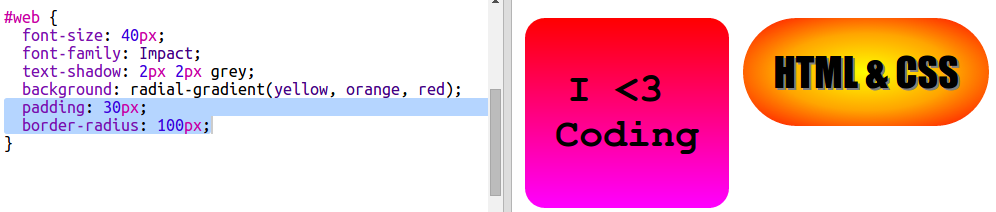

## HTML & CSS-sticker

Verlopen kunnen ook van het midden naar de randen toe van kleur veranderen, dit wordt een radiaal verloop genoemd.

+ Laten we een sticker maken met de tekst `HTML & CSS.` `&` is een ander karakter dat gecodeerd moet worden in HTML, de code is `&amp;`.
    
    Voeg de gemarkeerde code toe om een ​​nieuwe sticker te maken:
    
    

+ Schakel nu over naar je `style.css` bestand en voeg een stijl toe voor je nieuwe sticker:
    
    
    
    De `text-shadow` code voegt een schaduw toe die 2px onder en rechts van de tekst uitsteekt om hem te laten opvallen.

+ Nu het verloop. Laten we deze keer een radiaal verloop gebruiken. De kleur verandert van geel in het midden naar oranje en vervolgens rood.
    
    
    
    Let op: verlopen kunnen meerdere kleuren bevatten, niet alleen slechts twee.

+ De sticker ziet er veel beter uit met wat opvulling en een afgeronde rand.
    
    Voeg de gemarkeerde code toe:
    
    