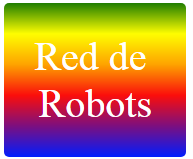

--- challenge ---

## Uitdaging: maak je eigen sticker met verloop

Maak nu je eigen sticker met een verloop. Probeer lineaire en radiale verlopen met meerdere HTML-kleuren.

Je moet het volgende doen:

+ Voeg een `
` met je stickertekst toe aan `index.html` en geef het de class `sticker` en een nieuwe `id`.
+ Voeg een stijl toe voor de `id` die je hebt gekozen in `style.css`. Je zou een van de stickerstijlen die je al hebt gemaakt kunnen kopiëren en bewerken. 

Er is een lijst met alle kleurnamen die je kunt gebruiken: [jumpto.cc/web-colours](http://jumpto.cc/web-colours), met kleurnamen zoals `tomato`, `firebrick` en `peachpuff`.

Als je de tekstkleur wilt wijzigen, kun je `color:` gebruiken.

Hier is een voorbeeld van wat je kunt doen met meerdere kleuren in een lineair verloop:

--- /challenge ---