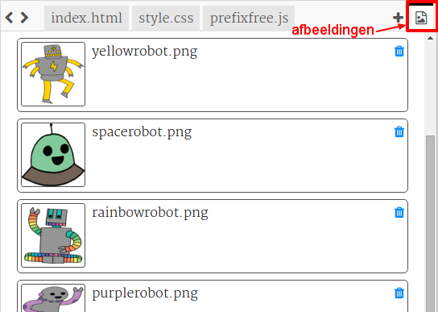
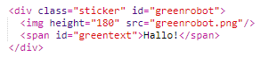
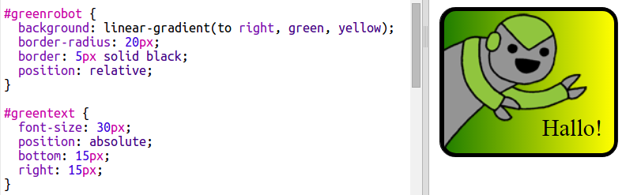

--- challenge ---

## Uitdaging: meer stickers maken

Probeer nu meer stickers te maken door verschillende verlooprichtingen, afbeeldingen, tekst, randen en contouren toe te voegen.

Tip: je moet voor elke sticker HTML en CSS toevoegen.

Je kunt een van je voorbeelden kopiëren en wijzigingen aanbrengen om een ​​nieuwe sticker te maken.

Je project bevat al een reeks robotafbeeldingen. Klik op het pictogram afbeeldingen om de beschikbare afbeeldingen te bekijken.

Dit voorbeeld gebruikt een lineair verloop met `to right`:

--- /challenge ---

***
Dit project werd vertaald door vrijwilligers:

**Cor Groot**

**Henny van Ham**

Dankzij vrijwilligers kunnen we mensen over de hele wereld de kans geven om in hun eigen taal te leren. Jij kunt ons helpen meer mensen te bereiken door vrijwillig te starten met vertalen - meer informatie op [rpf.io/translate](https://rpf.io/translate).