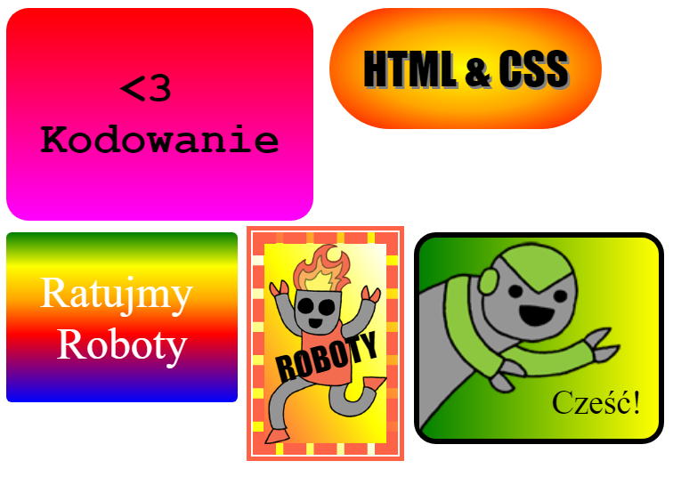

## Wprowadzenie

W tym projekcie wykonasz wiele zabawnych naklejek, których możesz użyć do ozdobienia swoich stron internetowych. Nauczysz się, jak używać gradientu, żeby twoje naklejki fajnie wyglądały.

### Dodatkowe informacje dla liderów klubów

Jeśli chcesz wydrukować ten projekt, użyj [wersji do druku](https://projects.raspberrypi.org/en/projects/stickers/print).

## \--- collapse \---

## title: Dla lidera klubu

## Wprowadzenie:

Wykonując ten projekt dzieci poznają liniowy i promienisty gradient w CSS. Nauczą się też więcej o ramkach i pozycjonowaniu.

## Zasoby Online

Do pisania kodu HTML i CSS online rekomendujemy użytkowanie edytora [trinket](https://trinket.io/). Do tego projektu udostępnione są też szablony:

* ["Naklejki" - początek -- jumpto.cc/web-sunrise](http://jumpto.cc/web-sunrise)

Dzieci mogą też używać pustego edytora [(jumpto.cc/html-blank)](http://jumpto.cc/html-blank) do pisania swojego kodu HTML i CSS lub skorzystać z tego szablonu [(jumpto.cc/html-template)](http://jumpto.cc/html-template).

Dostępny jest także projekt zawierający przykładowe rozwiązania wyzwań:

* [Ukończone "Naklejki" -- trinket.io/html/bb4e538e0a](https://trinket.io/html/bb4e538e0a)

## Zasoby Offline

Ten projekt można także [wykonać offline](https://www.codeclubprojects.org/en-GB/resources/webdev-working-offline/). Materiały potrzebne do wykonania projektu dostępne są po kliknięciu linku "Materiały do projektu". Można znaleźć tam sekcję "Źródła", która zawiera zasoby potrzebne dzieciom do wykonania projektu w trybie offline. Upewnij się, że każde dziecko ma dostęp do tych zasobów. Ta sekcja zawiera następujące pliki:

* intro/index.html
* template/template.html
* template/style.css
* stickers/index.html
* stickers/style.css
* stickers/script.js
* stickers/robot .png images

Ukończoną wersję zadań z tego projektu można również znaleźć w sekcji "Zasoby dla wolontariuszy", która zawiera:

* stickers-finished/index.html
* stickers-finished/style.css
* stickers-finished/script.js
* stickers-finished/robot .png images

(Wszystkie powyższe zasoby można również pobrać jako pliki `.zip`.)

## Cele dydaktyczne

* Ten projekt wprowadza użycie gradientów CSS do tworzenia ciekawych efektów. Uczniowie poszerzą również swoją wiedzę na temat ramek i pozycjonowania w CSS. 

Ten projekt obejmuje elementy z następujących wątków [Raspberry Pi Digital Making Curriculum](http://rpf.io/curriculum):

* [Projektowanie podstawowych zasobów 2D i 3D](https://www.raspberrypi.org/curriculum/design/creator).

## Wyzwania

* "Stwórz swoją własną gradientową naklejkę" - dodawanie liniowego i promienistego gradientu do tekstu;
* "Zrób więcej naklejek!' - połączenie gradientów z obrazkami i tekstem celem stworzenia kolejnych naklejek.

\--- /collapse \---

## \--- collapse \---

## title: Materiały do projektu

## Zasoby

* [Plik .zip zawierający wszystkie zasoby potrzebne do wykonania projektu](resources/stickers-project-resources.zip)
* [Szablon startowy "Intro"](http://jumpto.cc/web-intro)
* [Szablon startowy "Naklejki"](http://jumpto.cc/web-stickers)
* [Pusty szablon](http://jumpto.cc/trinket-template)
* [Pusty Trinket](http://jumpto.cc/trinket-blank)
* [template/index.html](resources/template-index.html)
* [template/style.css](resources/template-style.css)
* [stickers/index.html](resources/stickers-index.html)
* [stickers/style.css](resources/stickers-style.css)
* [stickers/prefixfree.js](resources/stickers-prefixfree.js)
* [stickers/bluerobot.png](resources/stickers-bluerobot.png)
* [stickers/firerobot.png](resources/stickers-firerobot.png)
* [stickers/purplerobot.png](resources/stickers-purplerobot.png)
* [stickers/spacerobot.png](resources/stickers-spacerobot.png)
* [stickers/dogrobot.png](resources/stickers-dogrobot.png)
* [stickers/greenrobot.png](resources/stickers-greenrobot.png)
* [stickers/rainbowrobot.png](resources/stickers-rainbowrobot.png)
* [stickers/yellowrobot.png](resources/stickers-yellowrobot.png)

## Zasoby dla lidera klubu

* [Plik .zip zawierający zasoby z ukończonym projektem](resources/stickers-volunteer-resources.zip)
* [Ukończony projekt "Naklejki"](https://trinket.io/html/bb4e538e0a)
* [stickers-finished/index.html](resources/stickers-finished-index.html)
* [stickers-finished/style.css](resources/stickers-finished-style.css)
* [stickers-finished/prefixfree.js](resources/stickers-finished-prefixfree.js)
* [stickers-finished/bluerobot.png](resources/stickers-finished-bluerobot.png)
* [stickers-finished/firerobot.png](resources/stickers-finished-firerobot.png)
* [stickers-finished/purplerobot.png](resources/stickers-finished-purplerobot.png)
* [stickers-finished/spacerobot.png](resources/stickers-finished-spacerobot.png)
* [stickers-finished/dogrobot.png](resources/stickers-finished-dogrobot.png)
* [stickers-finished/greenrobot.png](resources/stickers-finished-greenrobot.png)
* [stickers-finished/rainbowrobot.png](resources/stickers-finished-rainbowrobot.png)
* [stickers-finished/yellowrobot.png](resources/stickers-finished-yellowrobot.png)

\--- /collapse \---