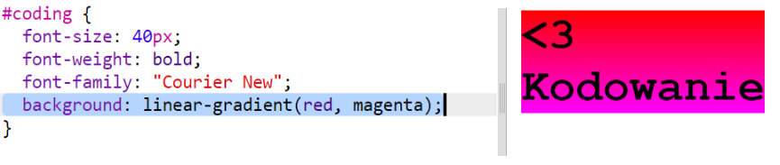
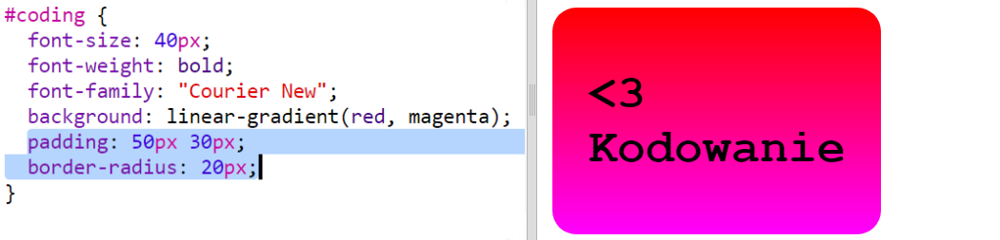

## Naklejka z liniowym gradientem

Gradient to stopniowe przejście z jednego koloru w drugi. Gradienty mogą być używane, aby osiągnąć ciekawe efekty. Zaraz użyjesz ich do stworzenia naklejek, które będzie można wykorzystać na stronach internetowych.

+ Otwórz edytor: <a href="http://jumpto.cc/web-stickers" target="_blank">jumpto.cc/web-stickers</a>.
    
    Projekt powinien wyglądać następująco:
    
    

+ Zróbmy naklejkę "<3 Kodowanie"g' sticker.
    
    Użyj `
` z klasą `sticker` i identyfikatorem `coding`, aby później go ostylować:
    
    

+ Hmm, widzisz, że edytor pokazał błąd? A to dlatego, że “<” to w HTML-u znak specjalny. Zamiast “<” musisz użyć specjalnego kodu `&lt;`.
    
    Zmień swój kod i użyj `&lt;`, aby pozbyć się tego błędu.
    
    
    
    ` ` powoduje przejście do następnej linii.

+ Teraz zmieńmy naklejkę tak, aby była nieco ciekawsza.
    
    Przejdź do pliku `style.css`. Zauważ, że klasa `.sticker` jest już opisana w taki sposób, aby naklejka wyświetlała się na stronie i miała wyśrodkowaną zawartość.
    
    Pamiętaj, że do swojej naklejki dodałeś identyfikator `coding`. Na końcu pliku `style.css` dodaj poniższy kod, aby ostylować tekst:
    
    

+ Teraz możesz dodać gradient jako tło naklejki. Liniowy gradient polega na zmianie koloru z jednego w drugi wzdłuż linii prostej.
    
    Taki gradient powoduje przejście z czerwonego na górze do purpurowego na dole. Dodaj poniższy kod do stylu `coding`:
    
    

+ Możesz jeszcze ulepszyć efekt dodając odpowiednie odstępy i zaokrąglone narożniki.
    
    Dodaj podświetlony kod:
    
    
    
    Atrybut `padding` dodaje odstęp wielkości 50px na górze i dole oraz 30px z lewej i prawej strony.