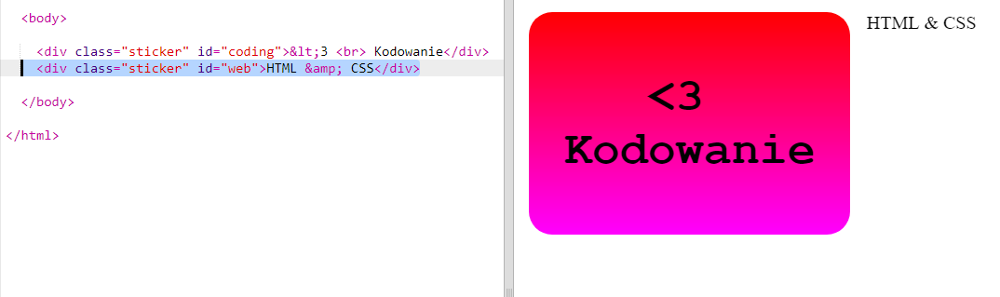
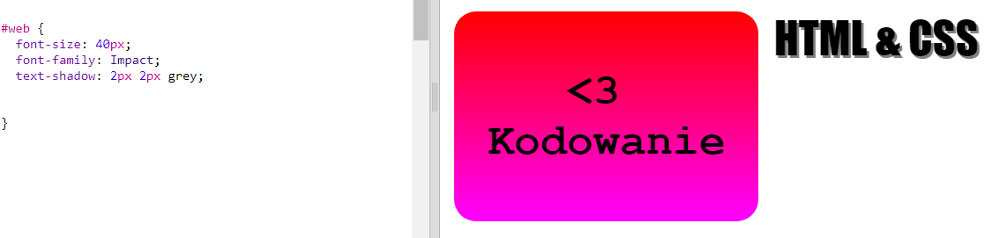
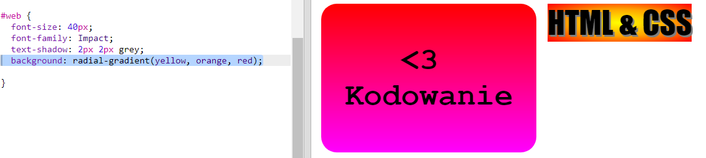
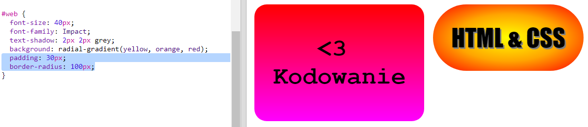

## Naklejka z promienistym gradientem

Gradienty mogą też zmieniać kolor od środka w kierunku krawędzi - nazywamy je gradientami promienistymi.

+ Zróbmy naklejkę z tekstem `HTML & CSS.` `&` to kolejny znak, który musimy zakodować w HTML-u, kod tego znaku to `&amp;`.
    
    Aby stworzyć nową naklejkę, dodaj podświetlony kod:
    
    

+ Teraz przejdź do pliku `style.css` i dodaj styl do swojej nowej naklejki:
    
    
    
    Atrybut `text-shadow` dodaje cień, który znajduje się 2px niżej i bardziej na prawo od tekstu. W ten sposób sprawiamy wrażenie jakby tekst wystawał.

+ Przejdźmy teraz do gradientu. Tym razem użyjemy gradientu promienistego. Kolor będzie zmieniał się od żółtego na środku przez pomarańczowy po czerwony.
    
    
    
    Zauważ, że gradienty mogą zawierać więcej niż dwa kolory.

+ Naklejka będzie wyglądać znacznie lepiej kiedy dodamy do niej odstępy i zaokrągloną ramkę.
    
    Dodaj podświetlony kod:
    
    