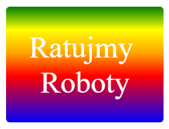

\--- challenge \---

## Wyzwanie: Twoja własna naklejka z gradientem

Stwórz swoją naklejkę z gradientem. Spróbuj liniowego i promienistego gradientu używając różnych kolorów.

Aby to zrobić:

+ W pliku `index.html` dodaj `
` z tekstem, jaki ma być na naklejce i nadaj mu klasę `sticker` oraz nowy identyfikator (`id`).
+ W pliku `style.css` dodaj styl korzystając z identyfikatora, jaki nadałeś wcześniej. Możesz skopiować style innej naklejki i zmienić według własnego uznania. 

Tutaj znajdziesz listę ze wszystkimi nazwami kolorów, których możesz użyć: [jumpto.cc/web-colours](http://jumpto.cc/web-colours) (np. `tomato`, `firebrick`, `peachpuff`).

Jeśli chcesz zmienić kolor tekstu możesz użyć `color:`.

Oto co można zrobić używając różnych kolorów w gradiencie liniowym:

\--- /challenge \---