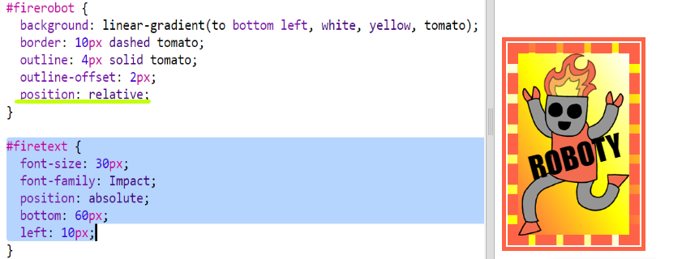

## Naklejka z gradientem i obrazkiem

Możesz zrobić też naklejkę z gradientem używając obrazka. Gradient będzie widoczny, jeśli użyjesz obrazka z przezroczystym tłem.

Możesz także użyć gradientów skierowanych w różne strony.

+ Dodaj naklejkę do `index.html` używając obrazka `firerobot.png`:
    
    
    
    Możesz zmienić `height` (ang. wysokość) obrazka, aby zmienić jego rozmiar. Szerokość dostosuje się automatycznie.

+ Zazwyczaj liniowy gradient zaczyna się u góry i kończy na dole. Jeśli jednak dodamy `to`, możemy zmienić kierunek gradientu (np. `to top` - do góry, `to left` - do lewej, `to right` - do prawej).
    
    Możesz także zrobić skośne gradienty które idą od jednego narożnika do drugiego. Musisz wtedy podać dwa kierunki. Ten przykład używa `to bottom left` (ang. do dołu do lewej).
    
    Dodaj poniższy kod do `style.css` aby nadać naklejce z robotem skośny gradient i fajną ramkę:
    
    
    
    Zauważ, że możesz użyć `outline` aby stworzyć kolejną ramkę na zewnątrz tej zwykłej. `outline-offset` określa odległość między ramkami.

+ Dodaj trochę tekstu na naklejce.
    
    W pliku `index.html` dodaj tag `` zawierający tekst “ROBOTY” i nadaj mu identyfikator.
    
    

+ Tekst będzie wyglądał lepiej kiedy go powiększysz i ustawisz w odpowiednim miejscu.
    
    Aby ustawić tekst musisz dodać `position: relative;` do `#greensticker` i `position: absolute` do `#greentext`. Opisywaliśmy to szczegółowo w projekcie `Zbuduj robota`.
    
    Dodaj podświetlony kod do `style.css`:
    
    

+ A na koniec obróćmy trochę tekst używając `transform: rotate`.
    
    
    
    Spróbuj pozmieniać ilość stopni, o jaką obrócony jest tekst.