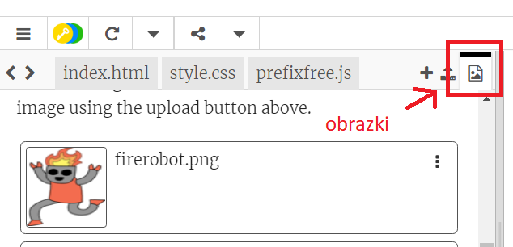

\--- challenge \---

## Wyzwanie: Jeszcze więcej naklejek

Teraz spróbuj zrobić więcej naklejek używając gradientów w różnych kierunkach, dodając obrazki i tekst oraz używając obu rodzajów ramek.

Wskazówka: musisz dodać kod HTML i CSS dla każdej naklejki.

Możesz skopiować jeden z przykładów i zmienić go tak, aby utworzyć nową naklejkę.

Twój projekt zawiera już zbiór obrazków robotów. Kliknij na ikonę obrazków, aby wyświetlić dostępne obrazki.

Oto przykład z użyciem gradientu `to right`:

\--- /challenge \---