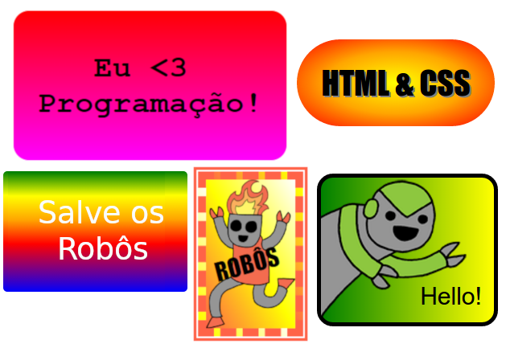

## Introdução

Neste projeto, você criará muitos adesivos divertidos que você poderá usar para decorar páginas da web. Você aprenderá sobre o uso de gradientes que mudam gradualmente de uma cor para outra para fazer seus adesivos bem legais.

### Informação adicional para líderes de clubes

Se você precisar imprimir este projeto, use a [Versão para Impressão](https://projects.raspberrypi.org/en/projects/stickers/print).

## \--- collapse \---

## title: Notas do líder do clube

## Introdução:

Neste projeto, as crianças aprenderão gradientes lineares e radiais em CSS. Eles também aprenderão mais sobre bordas e posicionamento.

## Recursos Online

Recomendamos usar o [trinket](https://trinket.io/) para escrever HTML & CSS online. Este projeto contém os seguintes trinkets:

* [Ponto de partida do 'Adesivos' -- jumpto.cc/web-stickers](http://jumpto.cc/web-stickers)

As crianças também podem fazer uso deste trinket em branco [(jumpto.cc/html-blank)](http://jumpto.cc/html-blank) para escrever seu próprio HTML & CSS, ou como alternativa, eles podem usar este template do trinket [(jumpto.cc/html-template)](http://jumpto.cc/html-template).

Há também um Trinket contendo um exemplo de solução para os desafios:

* ['Stickers' (Adesivos) Concluído - trinket.io/html/bb4e538e0a](https://trinket.io/html/bb4e538e0a)

## Recursos Offline

Este projeto pode ser [concluído offline](https://www.codeclubprojects.org/en-GB/resources/webdev-working-offline/), se você preferir. Você pode acessar os recursos disponíveis clicando no link 'Materiais do Projeto'. Este link contém uma seção 'Recursos do Projeto', que inclui recursos que as crianças precisarão para concluir esse projeto offline. Certifique-se de que cada criança tenha acesso a uma cópia desses recursos. Esta seção inclui os seguintes arquivos:

* intro/index.html
* template/template.html
* template/style.css
* stickers/index.html
* stickers/style.css
* stickers/script.js
* stickers/robot .png images

Você também pode encontrar uma versão completa dos desafios deste projeto na seção "Recursos para Voluntários", que contém:

* stickers-finished/index.html
* stickers-finished/style.css
* stickers-finished/script.js
* stickers-finished/robot .png images

(Todos os recursos acima também podem ser baixados como arquivos de projeto e de voluntário no formato `.zip`.)

## Objetivos de Aprendizado

* Este projeto introduz o uso de gradientes CSS para criar alguns efeitos interessantes. Os alunos também ampliarão seus conhecimentos sobre bordas e posicionamento de CSS. 

Este projeto abrange elementos das seguintes vertentes do [Currículo de Criação Digital Raspberry Pi](http://rpf.io/curriculum):

* [Design básico de elementos 2D e 3D](https://www.raspberrypi.org/curriculum/design/creator).

## Desafios

* "Crie seu próprio adesivo com gradiente" - adicionando gradientes lineares e radiais ao texto;
* "Faça mais adesivos!" - Combine gradientes com imagens e texto para criar mais adesivos.

\--- /collapse \---

## \--- collapse \---

## title: Materiais do projeto

## Recursos do projeto

* [arquivo .zip contendo todos os recursos do projeto](http://rpf.io/p/en/stickers-go)
* [Trinket Online contendo todos os recursos do projeto 'Intro'](http://jumpto.cc/web-intro)
* [Trinket Online contendo todos os recursos do projeto 'Adesivos'](http://jumpto.cc/web-stickers)
* [Template Online Trinket](http://jumpto.cc/trinket-template)
* [Trinket online em branco](http://jumpto.cc/trinket-blank)
* [template/index.html](resources/template-index.html)
* [template/style.css](resources/template-style.css)
* [stickers/index.html](resources/stickers-index.html)
* [stickers/style.css](resources/stickers-style.css)
* [stickers/prefixfree.js](resources/stickers-prefixfree.js)
* [stickers/bluerobot.png](resources/stickers-bluerobot.png)
* [stickers/firerobot.png](resources/stickers-firerobot.png)
* [stickers/purplerobot.png](resources/stickers-purplerobot.png)
* [stickers/spacerobot.png](resources/stickers-spacerobot.png)
* [stickers/dogrobot.png](resources/stickers-dogrobot.png)
* [stickers/greenrobot.png](resources/stickers-greenrobot.png)
* [stickers/rainbowrobot.png](resources/stickers-rainbowrobot.png)
* [stickers/yellowrobot.png](resources/stickers-yellowrobot.png)

## Recursos do líder do clube

* [arquivo .zip contendo todos os recursos do projeto](http://rpf.io/p/en/stickers-go)
* [Projeto Trinket online completo](https://trinket.io/html/bb4e538e0a)
* [stickers-finished/index.html](resources/stickers-finished-index.html)
* [stickers-finished/style.css](resources/stickers-finished-style.css)
* [stickers-finished/prefixfree.js](resources/stickers-finished-prefixfree.js)
* [stickers-finished/bluerobot.png](resources/stickers-finished-bluerobot.png)
* [stickers-finished/firerobot.png](resources/stickers-finished-firerobot.png)
* [stickers-finished/purplerobot.png](resources/stickers-finished-purplerobot.png)
* [stickers-finished/spacerobot.png](resources/stickers-finished-spacerobot.png)
* [stickers-finished/dogrobot.png](resources/stickers-finished-dogrobot.png)
* [stickers-finished/greenrobot.png](resources/stickers-finished-greenrobot.png)
* [stickers-finished/rainbowrobot.png](resources/stickers-finished-rainbowrobot.png)
* [stickers-finished/yellowrobot.png](resources/stickers-finished-yellowrobot.png)

\--- /collapse \---