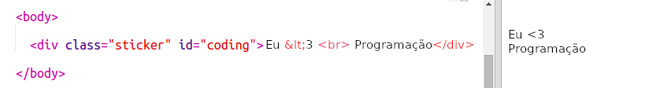
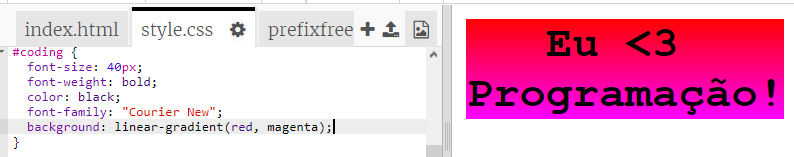

## Adesivo colorido sobre Programação

Um gradiente é uma mudança gradual de uma cor para outra. Os gradientes podem ser usados ​​para criar efeitos interessantes. Você vai usá-los para criar adesivos que pode usar em suas páginas web.

+ Abra este trinket: <a href="http://jumpto.cc/web-stickers" target="_blank">jumpto.cc/web-stickers</a>.
    
    O projeto deve ficar assim:
    
    

+ Vamos fazer um adesivo 'Eu <3 Programação!' g' sticker.
    
    Use um `
` com uma classe `sticker` e um id `coding` para que você possa estilizá-lo:
    
    

+ Hmm, você percebeu que você tem um erro? Isso ocorre porque '<' é um caractere especial em HTML. Em vez de '<' você precisa usar o código especial `&lt;`.
    
    Altere seu código para usar `&lt;` assim o erro desaparece.
    
    
    
    ` ` cria uma nova linha.

+ Agora vamos fazer o adesivo parecer interessante.
    
    Alterne para o arquivo `style.css`. Você verá que a classe `.sticker` já foi fornecida. Isto irá formatar os adesivos da página e centralizar seu conteúdo.
    
    Lembre-se que você adicionou o id `coding` para o seu adesivo. Na parte inferior do `style.css` adicione o seguinte código para estilizar o texto:
    
    

+ Agora você pode adicionar um gradiente para o plano de fundo do adesivo. Um gradiente linear muda de uma cor para outra ao longo de uma linha reta.
    
    Este gradiente irá mudar de vermelho na parte superior para magenta na parte inferior. Adicione o código de gradiente ao seu estilo `coding`:
    
    

+ Você pode melhorar o resultado adicionando espaçamento e cantos arredondados.
    
    Adicione o código destacado:
    
    
    
    O estilo `padding` adiciona o preenchimento de 50px na parte superior e inferior e 30px à esquerda e à direita.