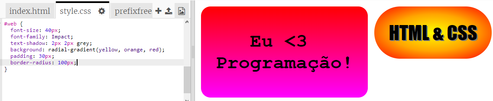

## Adesivo de HTML & CSS

Os gradientes também podem mudar de cor do centro para as bordas, isso é chamado de gradiente radial.

+ Vamos criar um adesivo com o texto `HTML & CSS.` `&` é outro caractere que precisa ser codificado em HTML, o código é `&amp;`.
    
    Adicione o código destacado para criar um novo adesivo:
    
    

+ Agora mude para o seu arquivo `style.css` e adicione um estilo para o seu novo adesivo:
    
    
    
    O código `text-shadow` (texto-sombra) adiciona uma sombra que se estende 2px abaixo e à direita do texto para torná-lo mais destacado.

+ Agora para o gradiente. Desta vez vamos usar um gradiente radial. A cor mudará de amarelo no centro para laranja e depois vermelho.
    
    
    
    Observe que os gradientes podem incluir várias cores, não apenas duas.

+ O adesivo ficará muito melhor com algum espaçamento e borda arredondada.
    
    Adicione o código destacado:
    
    