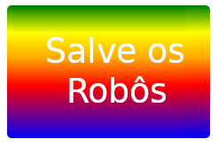

\--- challenge \---

## Desafio: Criar seu próprio adesivo com gradiente

Agora faça o seu próprio adesivo com gradiente. Tente gradientes lineares e radiais, usando várias cores HTML.

Você precisará de:

+ Adicione um `
` com o texto de seu adesivo ao `index.html` e dê a ele o nome de classe `sticker ` e um novo ` id `.
+ Adicionar estilo para o `Id ` você escolheu ao` style.css `. Você pode copiar um dos estilos de adesivo que você já criou e editá-lo. 

Há uma lista de todos os nomes de cores que você pode usar em [jumpto.cc/colours](http://jumpto.cc/web-colours), que inclui nomes de cores como `tomato` (Tomate), `firebrick` (tijolo fumegante) e `peachpuff` (sopro de pêssego).

Se você deseja alterar a cor de texto você pode usar `color:`.

Veja um exemplo do que você pode fazer com várias cores em um gradiente linear:

\--- /challenge \---