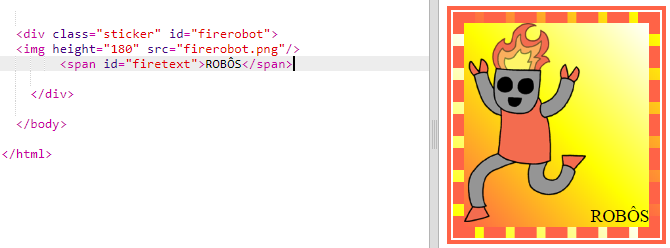
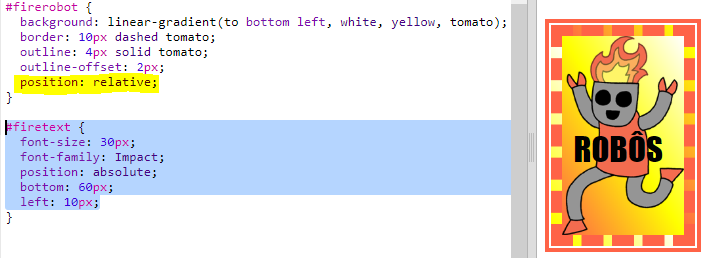
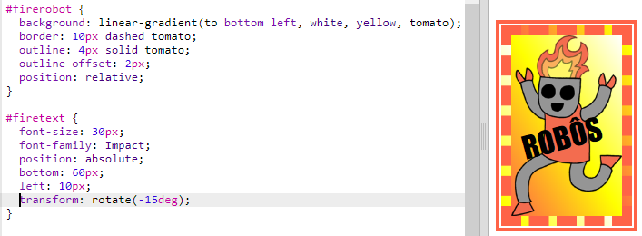

## Adesivo de robô enfeitado

Você pode fazer um adesivo com gradiente usando uma imagem. Se você usar uma imagem com fundo transparente, o gradiente será exibido ao fundo.

Você também pode criar gradientes para percorrer diferentes direções.

+ Adicione um adesivo ao `index.html` usando a imagem `firerobot.png`:
    
    
    
    Você pode ajustar a altura `height` para redimensionar a imagem, a largura mudará automaticamente.

+ Normalmente, um gradiente linear começa seu percurso de cima para baixo, mas você pode usar `to` para mudar a direção. Por exemplo: `to top` (para o topo), `to left` (para a esquerda) ou `to right` (para a direita).
    
    Para um gradiente diagonal, forneça duas direções. Este exemplo usa `to bottom left` (para o canto inferior esquerdo).
    
    Adicione este estilo ao `style.css` para dar a sua nova vinheta do robô, um gradiente diagonal e uma borda enfeitada:
    
    
    
    Observe que você pode usar a `outline` (contorno) para criar outra borda do lado de fora da borda usual. `outline-offset` (espaçamento de contorno) cria uma lacuna entre a borda e o contorno.

+ Vamos adicionar um texto a este adesivo.
    
    Adicione um `` contendo o texto "ROBÔS" ao `index.html` e dê a ele um id.
    
    

+ O texto ficará melhor se você aumentá-lo e posicioná-lo.
    
    Para posicionar o texto, você precisará adicionar `position: relative;` para `#firerobot` e `position: absolute` para `#firetext`. Posicionamento é coberto com mais detalhes no projeto `Construa um Robô`.
    
    Adicione o seguinte código ao `style.css`:
    
    

+ E para um toque final, vamos girar o texto usando `transform: rotate` (transformação de rotação).
    
    
    
    Tente alterar o número de graus que o texto é girado.