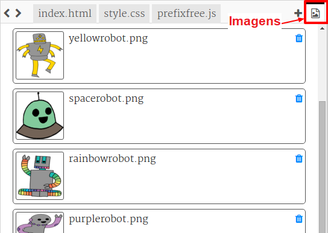

--- challenge ---

## Desafio: faça mais adesivos

Agora tente criar mais adesivos usando diferentes direções de gradiente e adicionando imagens e texto e usando bordas e contornos.

Dica: você precisará adicionar códigos HTML e CSS para cada adesivo.

Você pode copiar e editar um dos seus exemplos e fazer alterações para criar um novo adesivo.

Seu projeto já inclui um conjunto de imagens de robôs. Clique no ícone de imagens para ver as imagens disponíveis.

Este exemplo usa um gradiente linear com `to right` (para a direita):

--- /challenge ---

**Tradução Contribuída pela Comunidade**

Este projeto foi traduzido por **Denis Silva** e revisado por **Rodolfo Neugebauer**.

Nossos incríveis voluntários de tradução nos ajudam a dar as crianças em todo o mundo a oportunidade de aprender a programar. Você pode nos ajudar a alcançar mais crianças traduzindo nossos projetos - leia mais em [rpf.io/translate](https://rpf.io/translate).