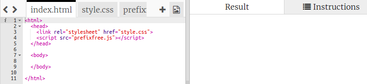

## Sticker colorat

Un gradient este o schimbare treptată de la o culoare la alta. Gradienții pot fi folosiți pentru a crea efecte cool. Le vei folosi pentru a crea stickere pe care le vei putea folosi pe paginile tale web.

+ Deschide acest trinket: <a href="http://jumpto.cc/web-stickers" target="_blank">jumpto.cc/web-stickers</a>.
    
    Proiectul ar trebui să arate astfel:
    
    

+ Hai să facem un 'I <3 Coding' sticker.
    
    Folosește un `
` cu o clasă `sticker` și un id `coding` pentru a-l putea personaliza:
    
    

+ Hmm, ai observat că ai primit o eroare? Asta pentru că caracterul „<” e un caracter speciale în HTML. În locul lui trebuie să folosim codul special `&lt;`.
    
    Actualizează-ți codul pentru a folosi `&lt;` pentru a elimina eroarea.
    
    
    
    ` ` începe o nouă linie.

+ Acum hai să facem sticker-ul să arate interesant.
    
    Deschide fișierul `style.css`. Vei vedea că clasa `.sticker` ți-a fost dată deja. Aceasta va personaliza stickerele din pagină și va centra conținutul lor.
    
    Nu uita că ai adăugat id-ul `coding` la sticker-ul tău. În partea de jos a fișierului `style.css`, adaugă următorul cod pentru a stiliza textul:
    
    

+ Acum poți adăuga un gradient pentru fundalul sticker-ului. Un gradient liniar își schimbă culoarea treptat de-a lungul unei linii drepte.
    
    Acest gradient își va schimba culoarea din roșu sus până în magenta jos. Adaugă codul gradientului tău la stilul `coding`:
    
    

+ Poți îmbunătăți rezultatul adăugând spațiere și colțuri rotunjite.
    
    Adaugă codul evidențiat:
    
    
    
    Stilul `padding` adaugă o spațiere de 50px în partea de sus și de jos și 30px în dreapta și stânga.