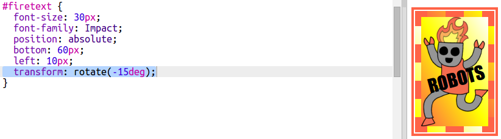

## Sticker mișto cu robot

Poți să faci un sticker cu gradient folosind o imagine. Dacă folosești imaginea cu un fundal transparent, gradientul se va vedea prin ea.

Poți să creezi gradienți pentru a se îndrepta în anumite direcții.

+ Adaugă un sticker în `index.html` folosind imaginea `firerobot.png`:
    
    
    
    Poți ajusta înălțimea prin proprietarea `height` pentru a redimensionea imaginea, lățimea modificându-se automat.

+ În mod normal, un gradient liniar merge de sus în jos, dar poți folosi `to` pentru a schimba direcția. De exemplu, `to top`, `to left` sau `to right`.
    
    Pentru un gradient în diagonală ai nevoie de două direcții. Acest exemplu folosește `to bottom left`.
    
    Adaugă acest stil în `style.css` pentru a da noului tău robot un gradient în diagonală și un chenar mișto:
    
    
    
    Nu uita că poți să folosești `outline` pentru a crea alt chenar în afara celui obișnuit. `outline-offset` creează un loc liber între margini și chenarul din exterior.

+ Hai să adăugăm niște text acestui sticker.
    
    Adaugă un `` care conține textul „ROBOTS” în `index.html` și dă-i un id.
    
    

+ Textul va arăta mai bine dacă îl faci mai mare și îl poziționezi.
    
    Pentru a poziționa textul va trebui să adaugi `position: relative;` la `#greensticker` și `position: absolute;` la `#greentext`. Poziționarea este explicată mai în detaliu în proiectul `Construiește un robot`.
    
    Adaugă următorul cod în `style.css`:
    
    

+ Și pentru o ultimă retușare, hai să rotim textul folosind `transform: rotate`.
    
    
    
    Încearcă să schimbi numărul de grade după care textul este rotit.