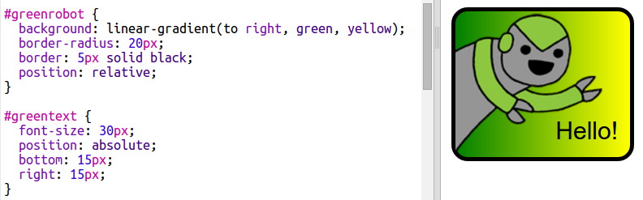

\--- challenge \---

## Provocare: Realizează mai multe stickere

Acum încearcă să faci mai multe stickere folosind diferite tipuri de gradient și adăugând imagini și text cu margini și chenare.

Sfat: Va trebui să adaugi HTML și CSS pentru fiecare sticker.

Poți copia și edita unul dintre exemple și să faci schimbări pentru a crea un nou sticker.

Proiectul tău deja include un set de imagini cu roboți. Dă click pe iconița imagine pentru a vedea imaginile disponibile.

Acest exemplu folosește un gradient liniar cu `to right`:

\--- /challenge \---