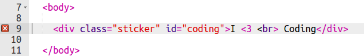

## Красочный стикер

Градиент - это постепенное изменение цвета от одного к другому. Градиенты могут быть использованы для создания крутых эффектов. Ты будешь использовать их для создания стикеров для своих веб-страниц.

+ Открой этот trinket: <a href="http://jumpto.cc/web-stickers" target="_blank"> jumpto.cc/web-stickers </a>.
    
    Проект должен выглядеть следующим образом:
    
    

+ Давай сделаем стикер 'Я <3 Программирование'g' sticker.
    
    Используй `
` с классом `sticker` и `coding` id, чтобы ты мог стилизовать его:
    
    

+ Хм, ты заметил, что случилась ошибка? Это потому, что «<» - это специальный символ в HTML. Вместо '<' тебе нужно использовать специальный код `&lt; `.
    
    Используй `&lt; ` и обнови свой код, чтобы ошибка исчезла.
    
    
    
    ` ` дает новую строку.

+ Теперь давай сделаем стикер интересным.
    
    Переключись на `style.css` файл. Ты увидишь, что `.sticker ` класс уже там. Это позволит тебе разместить наклейки на странице и расположить их содержимое в центре.
    
    Помните, что ты добавила(-а) id`coding ` к твоей наклейке. В нижней части ` style.css ` добавь следующий код для стилизации текста:
    
    

+ Теперь ты можешь добавить градиент для фона наклейки. Линейный градиент меняется от одного цвета к другому по прямой линии.
    
    Этот градиент изменится с красного сверху на пурпурный внизу. Добавь код градиента в твой ` coding` style:
    
    

+ Ты можешь улучшить результат, добавив отступы и округленные углы.
    
    Добавь выделенный код:
    
    
    
    Стиль ` padding ` добавляет отступ 50 пикселей сверху и снизу, а также 30 пикселей слева и справа.