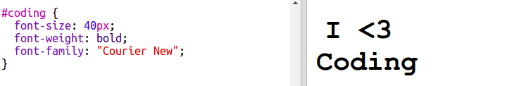

## Шарене налепнице за прогармирање

Градијент је постепена промена једне боје у другу. Градијенти се могу користити за креирање ефеката. Користићете их за прављење налепница које можете користити на својим веб страницама.

+ Отворите овај додатак: <a href="http://jumpto.cc/web-stickers" target="_blank">jumpto.cc/web-stickers</a>.
    
    Пројекат би требало да изгледа овако:
    
    

+ Направимо 'Ја <3 програмирањеg' sticker.
    
    Користите `
`са налепницом` ` class и `coding` id да бисте га могли стилизовати:
    
    

+ Хмм, да ли сте приметили да сте добили грешку? То је зато што је '<' посебан знак у HTML-у. Уместо '<' требате користити посебни код `&lt;`.
    
    Ажурирајте код да бисте користили `&lt;` тако да грешка нестаје.
    
    
    
    ` ` даје нову линију.

+ А сада да учинимо да налепница изгледа занимљиво.
    
    Пребаците се на `style.css` датотеку. Видећете да је налепница `.sticker` class обезбеђена за вас. Ово ће поставит налепнице на страницу и центрирати њихов садржај.
    
    Не заборавите да сте додали id `coding` на вашу налепницу. На дну `style.css` додајте следећи код да бисте стилизовали текст:
    
    

+ Сада можете додати градијент за позадину налепнице. Линеарни градијент се мења из једне у другу боју дуж праве линије.
    
    Овај градијент ће се променити од црвене на врху до магента на дну. Додајте код градијента у програмирање `coding` стил:
    
    

+ Резултат можете побољшати додавањем одстојања и заобљених углова.
    
    Додајте означени код:
    
    
    
    `padding` стил додаје одстојање од 50px на врху и на дну и 30px на левој и десној страни.