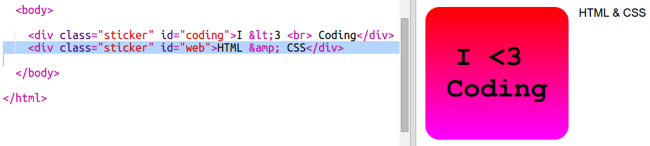
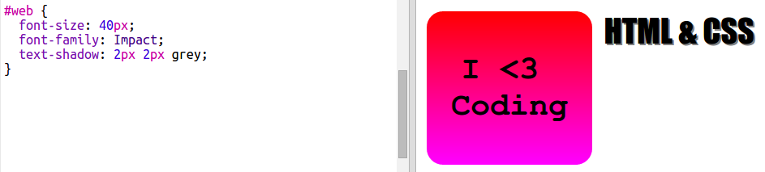

## HTML & CSS налепница

Градијенти такође могу мењати боју из центра према ивицама, то се назива радијални градијент.

+ Направимо налепницу са текстом `HTML & CSS.` `&` је други знак који треба да програмирамо у HTML-у, код је `&amp;`.
    
    Додајте означени код да бисте створили нову налепницу:
    
    

+ Сада се пребаците на `style.css` датотеку и додајте стил својој новој налепници:
    
    
    
    Текст `text-shadow` код додаје сенку која се протеже 2px испод и са десне стране текста како би се истакла.

+ Сада за градијент. Овог пута искористимо радијални градијент. Боја ће се променити од жуте у средини до наранџасте, а затим до црвене.
    
    
    
    Приметићете да градијенти могу укључивати више боја, а не само две.

+ Налепница ће изгледати много боље са мало одстојанја и заобљеном оквиром.
    
    Додајте означени код:
    
    