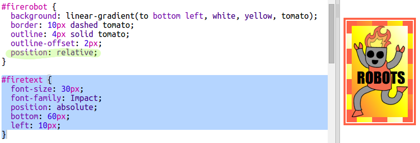

## Модерна налепница са роботима

Помоћу слике можете направити градијент налепницу. Ако користите слику с прозирном позадином, градијент ће бити видљив.

Такође можете да креирате градијенте усмерене у различитим правцима.

+ Додајте налепницу у `index.html` користећи `firerobot.png` слику:
    
    
    
    Можете подесити `height` Да бисте променили висину слике, ширина ће се аутоматски променити.

+ Обично линеарни градијент тече од врха до дна, али можете да користите `to` да промените смер. На пример: `to top`, `to left`, or `to right`.
    
    За дијагонални градијент дајете две смернице. Овај пример користи `to bottom left`.
    
    Додајте овај стил у `style.css` да бисте својој новој роботској налепници дали дијагонални градијент и лепу ивицу:
    
    
    
    Имајте на уму да можете користити `outline` да бисте створили још једну ивицу изван уобичајене. `outline-offset` даје размак између ивице и контуре.

+ Додајмо неки текст овој налепници.
    
    Додајте `` који садржи текст „РОБОТИ“ у `index.html` и дајте му id.
    
    

+ Текст ће изгледати боље ако га повећате и лепо позиционирате.
    
    За позиционирање текста требате додати `position: relative;` до `#greensticker` и `position: absolute` to `#greentext`. Позиционирање је детаљније описано у ` Изради робота ` пројекату.
    
    Следећи код додајте у `style.css`:
    
    

+ А за задњу промену, ротирајмо текст користећи `transform: rotate`.
    
    
    
    Покушајте да промените број степени за закретање текста.