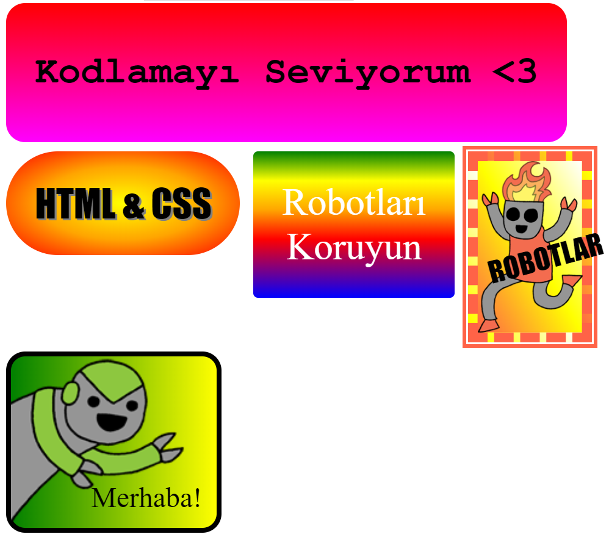

## Giriş

Bu projede, web sayfalarını süslemek için kullanabileceğiniz birçok eğlenceli çıkartma oluşturacaksınız. Çıkartmalarınızın havalı görünmesini sağlamak için bir renkten diğerine yavaş yavaş değişen gradyanları kullanmayı öğreneceksiniz.

### Kulüp liderleri için ek bilgi

Bu projeyi yazdırmanız gerekiyorsa, lütfen [Yazıcı dostu sürüm](https://projects.raspberrypi.org/en/projects/stickers/print)ü kullanın.

## \--- collapse \---

## title: Kulüp lideri notları

## Giriş:

Bu projede, çocuklara CSS'deki doğrusal ve radyal gradyanlar tanıtılacaktır. Ayrıca kenarlıklar ve konumlandırma hakkında da daha fazla bilgi edineceklerdir.

## Çevrimiçi Kaynaklar

Çevrimiçi olarak HTML & CSS yazmak için [trinket](https://trinket.io/) kullanmanızı öneririz. Bu proje aşağıdaki trinket'leri içerir:

* ['Çıkartmalar' başlangıç noktası -- jumpto.cc/web-stickers](http://jumpto.cc/web-stickers)

Çocuklar kendi HTML & CSS'lerini yazmak için ayrıca bu boş trinket'lerden [(jumpto.cc/html-blank)](http://jumpto.cc/html-blank) yararlanabilirler ya da alternatif olarak şu şablon trinket'i de [(jumpto.cc/html-template)](http://jumpto.cc/html-template) kullanabilirler.

Ayrıca meydan okumalara örnek bir çözüm içeren trinket da var:

* ['Çıkartmalar' Bitti -- trinket.io/html/bb4e538e0a](https://trinket.io/html/bb4e538e0a)

## Çevrimdışı Kaynaklar

Bu proje, istenirse [çevrimdışı](https://www.codeclubprojects.org/en-GB/resources/webdev-working-offline/) olarak tamamlanabilir. Proje kaynaklarına, bu proje için 'Proje Malzemeleri' bağlantısını tıklayarak erişebilirsiniz. Bu link, çocukların bu projeyi çevrimdışı tamamlamaları için ihtiyaç duyacağı kaynakları içeren bir 'Proje Kaynakları' bölümü içermektedir. Her çocuğun bu kaynakların bir kopyasına erişimi olduğundan emin olun. Bu bölüm aşağıdaki dosyaları içerir:

* intro/index.html
* template/template.html
* template/style.css
* stickers/index.html
* stickers/style.css
* stickers/script.js
* stickers/robot .png görselleri

Bu projenin meydan okumalarının tamamlanmış bir sürümünü 'Gönüllü Kaynaklar' bölümünde bulabilirsiniz; içerdikleri:

* stickers-finished/index.html
* stickers-finished/style.css
* stickers-finished/script.js
* stickers-finished/robot .png görselleri

(Yukarıdaki kaynakların tümü proje ve gönüllü olarak indirilebilen `.zip` dosyalarıdır.)

## Kazanımlar

* Bu proje, ilginç efektler oluşturmak için CSS gradyanlarının kullanımını tanıtmaktadır. Öğrenciler ayrıca CSS kenarlıkları ve konumlandırma bilgilerini de geliştireceklerdir. 

Bu proje, [Raspberry Pi Sayısal Yapım Müfredatı](http://rpf.io/curriculum) 'nın aşağıdaki bölümlerinden unsurları kapsamaktadır:

* [Temel 2B ve 3B varlıkların tasarlanması](https://www.raspberrypi.org/curriculum/design/creator).

## Meydan Okumalar

* "Kendi gradyan etiketinizi oluşturun" - metne doğrusal ve radyal gradyan ekleme;
* "Daha fazla çıkartma yap!" - Daha fazla çıkartma oluşturmak için gradyanları resimler ve metinlerle birleştirin.

\--- /collapse \---

## \--- collapse \---

## title: Proje materyalleri

## Proje kaynakları

* [tüm proje kaynaklarını içeren .zip dosyası](http://rpf.io/p/en/stickers-go)
* [Tüm 'Giriş' proje kaynaklarını içeren çevrimiçi Trinket](http://jumpto.cc/web-intro)
* [Tüm 'Çıkartmalar' proje kaynaklarını içeren çevrimiçi Trinket](http://jumpto.cc/web-stickers)
* [Çevrimiçi Trinket şablonu](http://jumpto.cc/trinket-template)
* [Çevrimiçi boş Trinket](http://jumpto.cc/trinket-blank)
* [template/index.html](resources/template-index.html)
* [template/style.css](resources/template-style.css)
* [stickers/index.html](resources/stickers-index.html)
* [stickers/style.css](resources/stickers-style.css)
* [stickers/prefixfree.js](resources/stickers-prefixfree.js)
* [stickers/bluerobot.png](resources/stickers-bluerobot.png)
* [stickers/firerobot.png](resources/stickers-firerobot.png)
* [stickers/purplerobot.png](resources/stickers-purplerobot.png)
* [stickers/spacerobot.png](resources/stickers-spacerobot.png)
* [stickers/dogrobot.png](resources/stickers-dogrobot.png)
* [stickers/greenrobot.png](resources/stickers-greenrobot.png)
* [stickers/rainbowrobot.png](resources/stickers-rainbowrobot.png)
* [stickers/yellowrobot.png](resources/stickers-yellowrobot.png)

## Kulüp lideri için kaynaklar

* [tamamlanmış tüm proje kaynaklarını içeren .zip dosyası](http://rpf.io/p/en/stickers-go)
* [Çevrimiçi tamamlanmış Trinket projesi](https://trinket.io/html/bb4e538e0a)
* [stickers-finished/index.html](resources/stickers-finished-index.html)
* [stickers-finished/style.css](resources/stickers-finished-style.css)
* [stickers-finished/prefixfree.js](resources/stickers-finished-prefixfree.js)
* [stickers-finished/bluerobot.png](resources/stickers-finished-bluerobot.png)
* [stickers-finished/firerobot.png](resources/stickers-finished-firerobot.png)
* [stickers-finished/purplerobot.png](resources/stickers-finished-purplerobot.png)
* [stickers-finished/spacerobot.png](resources/stickers-finished-spacerobot.png)
* [stickers-finished/dogrobot.png](resources/stickers-finished-dogrobot.png)
* [stickers-finished/greenrobot.png](resources/stickers-finished-greenrobot.png)
* [stickers-finished/rainbowrobot.png](resources/stickers-finished-rainbowrobot.png)
* [stickers-finished/yellowrobot.png](resources/stickers-finished-yellowrobot.png)

\--- /collapse \---