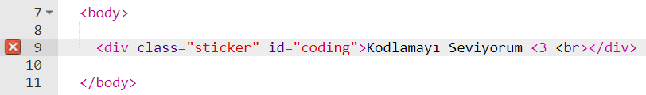
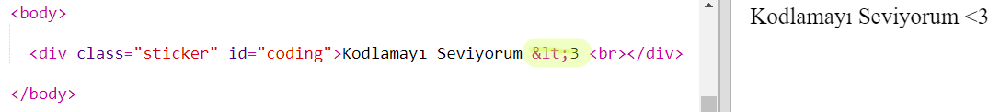
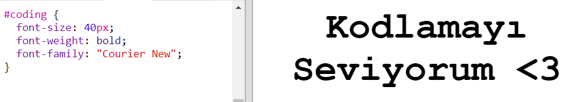
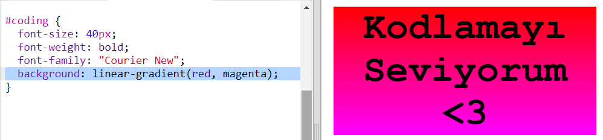
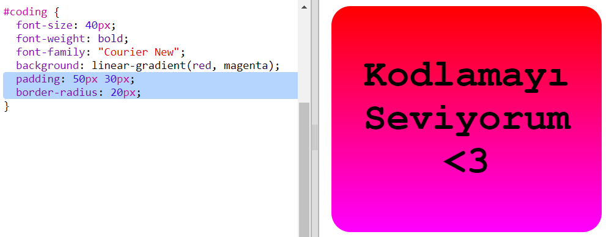

## Renkli kodlama çıkartması

Gradyan, bir renkten diğerine kademeli bir geçiştir. Gradyanlar, havalı efektler oluşturmak için kullanılabilir. Bunları web sayfalarınızda kullanabileceğiniz çıkartmalar oluşturmak için kullanacaksınız.

+ Şu trinketi açın: <a href="http://jumpto.cc/web-stickers" target="_blank">jumpto.cc/web-stickers</a>.
    
    Proje şöyle görünmeli:
    
    

+ Haydi 'I <3 Codin' çıkartması yapalımg' sticker.
    
    Bir `
`, bir `sticker` sınıfı, bir de `coding` id'si kullanın, böylelikle çıkartmanızı şekillendirebileceksiniz:
    
    

+ Hmm bir hatanın olduğunu fark ettin mi? Çünkü '<' HTML'ye özel bir karakterdir. Onun yerine `&lt;` özel kodunu kullanman gerekir.
    
    `&lt;` ögesini kullanabilmek için kodunuzu güncelleyin, böylelikle hata ortadan kalkacaktır.
    
    
    
    ` ` yeni bir çizgi verir.

+ Şimdi çıkartmanın ilginç görünmesini sağlayalım.
    
    `style.css` dosyasını açın. `.sticker` sınıfının sizin için ayrıldığını göreceksiniz. Bu, sayfadaki çıkartmaları düzenler ve içeriklerini ortalar.
    
    Çıkartmanıza `coding` id'sini eklemeyi unutmayın. `style.css` dosyasının en aşağısına, metni biçimlendirmek için aşağıdaki kodu eklemeyi unutmayın:
    
    

+ Şimdi çıkartmanın arka planı için bir gradyan ekleyebilirsiniz. Doğrusal bir gradyan, düz bir çizgi boyunca bir renkten diğerine geçer.
    
    Bu gradyan, yukarıdan aşağıya doğru kırmızıdan macentaya dönüşecektir. `coding` stil dosyanıza gradyan kodunu ekleyin:
    
    

+ Dolgu ve yuvarlak köşeler ekleyerek elde ettiğiniz sonucu iyileştirebilirsiniz.
    
    Vurgulanan kodu ekleyin:
    
    
    
    `padding` stili, üstten ve alttan 50, soldan ve sağdan 30 piksel dolgu ekler.