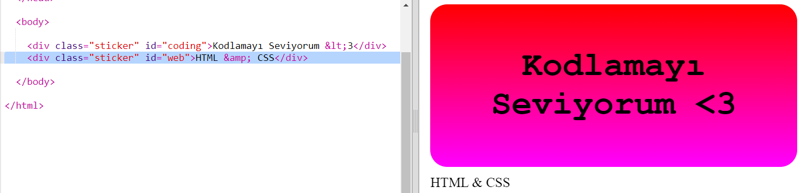
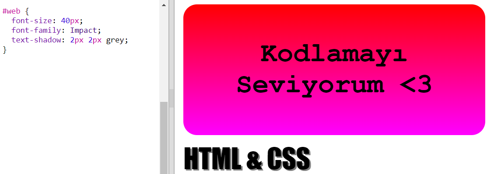
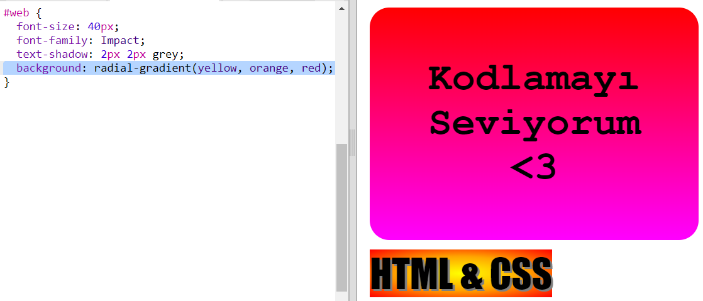

## HTML ve CSS çıkartması

Gradyanlar ayrıca merkezden kenarlara doğru renk değiştirebilir, buna radyal gradyan denir.

+ `HTML & CSS.` metnini içeren bir çıkartma oluşturalım. `&` HTML'de kodlanması gereken başka bir karakterdir. Kod `&amp;`.
    
    Yeni bir çıkartma oluşturmak için vurgulanan kodu ekleyin:
    
    

+ Şimdi `style.css` dosyasına geçin ve yeni çıkartmanız için bir stil ekleyin:
    
    
    
    `text-shadow` kodu, daha belirgin hale getirmek için metnin altına ve sağına 2 piksel uzanan bir gölge ekler.

+ Şimdi sıra gradyanda. Bu sefer radyal bir gradyan kullanalım. Renk, merkezden sarıdan, turuncuya ve daha sonra kırmızıya dönüşecektir.
    
    
    
    Gradyanların yalnızca iki değil, birden fazla renk içerebileceğine dikkat edin.

+ Çıkartma, bazı dolgu ve yuvarlak kenarlıklarla çok daha iyi görünecektir.
    
    Vurgulanan kodu ekleyin:
    
    