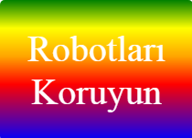

--- challenge ---

## Meydan Okuma: Kendi gradyan çıkartmanızı oluşturun

Şimdi kendi gradyan çıkartmanızı yapın. Birden çok HTML rengi kullanarak doğrusal ve radyal gradyanlar oluşturmayı deneyin.

Şunlara ihtiyacınız olacak:

+ `index.html` dosyasına etiket metninizle birlikte bir de `
` ekleyin ardından onu `sticker` etiket sınıfına ve yeni bir `id` etiketine verin.
+ `style.ccs` içerisinde seçtiğiniz `id` için stil ekleyin. Yapmış olduğunuz çıkartma stillerinden birini kopyalayabilir ve düzenleyebilirsiniz. 

Kullanabileceğiniz tüm renk isimlerinin bir listesi var: [jumpto.cc/web-colours](http://jumpto.cc/web-colours), `tomato`, `firebrick` ve `peachpuff` gibi renk isimlerini içerir.

Metin rengini değiştirmek isterseniz `color:` ögesini kullanabilirsiniz.

Doğrusal bir gradyanda birçok renkle neler yapabileceğinize bir örnek:

--- /challenge ---