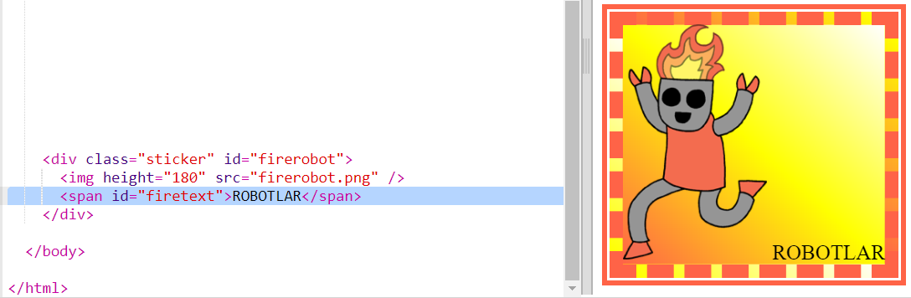
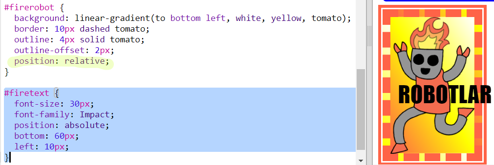
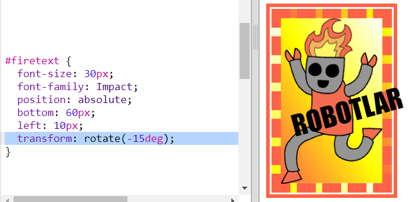

## Süslü robot çıkartması

Bir görsel kullanarak gradyan çıkartma yapabilirsiniz. Saydam arka planı olan bir görsel kullanırsanız, gradyan görünecektir.

Farklı yönlerde çalışacak için gradyanlar da oluşturabilirsiniz.

+ `index.html` dosyasına `firerobot.png` görselini kullanarak bir etiket ekleyin:
    
    
    
    Görüntüyü yeniden boyutlandırmak için `height` (yükseklik) ögesini ayarlayabilirsiniz. Genişlik otomatik olarak değişir.

+ Normalde doğrusal bir gradyan yukarıdan aşağıya doğru çalışır, ancak yönünü değiştirmek için `to` kulllanabilirsiniz. Örneğin: `to top`, `to left`, veya `to right`.
    
    Diyagonal -köşegen- gradyan için iki yön verin. Bu örnekte `to bottom left` kullanılmıştır.
    
    Yeni robot çıkartmanıza diyagonal bir gradyan ve süslü bir kenarlık vermek için bu stili `style.css` dosyasına ekleyin:
    
    
    
    `outline` ögesini, mevcut olandan ayrı bir dış kenarlık oluşturmak için kullanabileceğinizi unutmayın. `outline-offset` kenarlık ve anahat arasındaki boşluğu belirtir.

+ Bu çıkartmaya biraz metin ekleyelim.
    
    `index.html` dosyasına "ROBOTLAR" metnini içeren bir `` ekleyin ve bir kimlik verin.
    
    

+ Metni büyütür ve konumlandırırsanız daha iyi gözükecektir.
    
    Metni konumlandırmak için, `#greensticker` ögesine `position: relative;` ve`#greentext` ögesine `position: absolute` eklemeniz gerekir. Konumlandırma konusu, `Build a Robot` projesinde detaylı olarak anlatılacaktır.
    
    Aşağıdaki kodu `style.css` dosyasına ekleyin:
    
    

+ `transform: rotate` kullanıp metni döndürerek son dokunuşu yapalım.
    
    
    
    Metnin döndürüleceği derece sayısını değiştirmeyi deneyin.