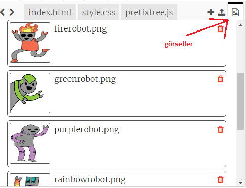
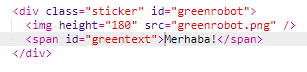
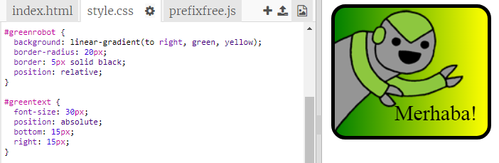

--- challenge ---

## Meydan Okuma: Daha fazla çıkartma yapın

Şimdi farklı gradyan yönlerini kullanarak daha fazla çıkartma yapmayı, resim ve metin eklemeyi ve kenarlıklarla anahatları kullanmayı deneyin.

İpucu: Her çıkartma için HTML ve CSS eklemeniz gerekir.

Örneklerinizden birini kopyalayıp düzenleyebilir ve yeni bir çıkartma oluşturmak için üzerinde değişiklikler yapabilirsiniz.

Projeniz zaten bir dizi robot görseli içeriyor. Kullanılabilir görselleri görüntülemek için resimler simgesine tıklayın.

Bu örnekte `to right` ile doğrusal bir gradyan kullanılmıştır:

--- /challenge ---

***
Bu proje gönüllüler tarafından tercüme edildi:

Muhammed Boğatekin

Murat Eray Korkmaz

Dünyanın dört bir yanındaki insanlara anadilinde öğrenme şansı verebildiğimiz için gönüllülere teşekkür ederiz. Daha fazla gönüllü tercümana ulaşmamızda bize yardımcı olabilirsiniz - [rpf.io/translate](https://rpf.io/translate) adresinden daha fazla bilgiye ulaşabilirsiniz.