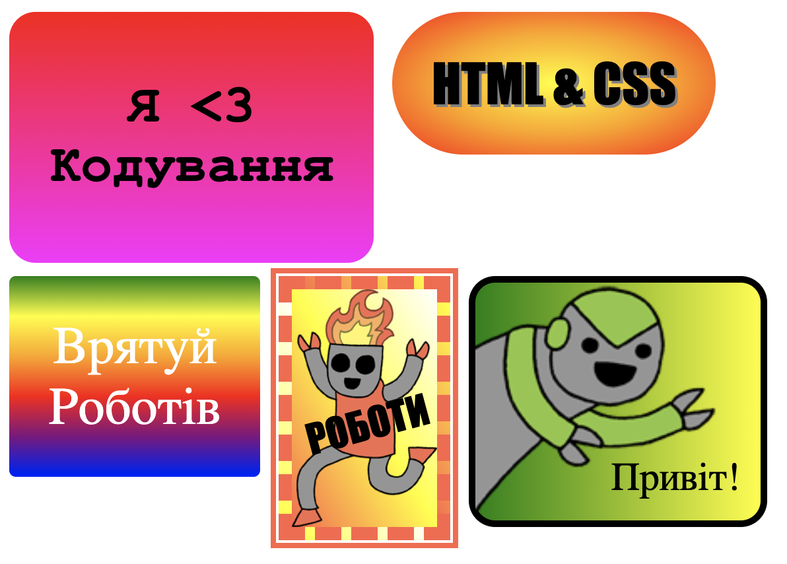

## Вступ

В цьому проєкті, ти створиш багато веселих наклейок, які можна використовувати, щоб прикрашати вебсторінки. Ти навчишся використовувати градієнти, які поступово змінюють колір від одного до іншого, щоб твої наклейки виглядали класно.

### Додаткова інформація для керівників клубів

Якщо вам потрібно роздрукувати цей проєкт, будь ласка, скористайтеся [версією для друку](https://projects.raspberrypi.org/uk-UA/projects/stickers/print).

--- collapse ---
---
title: Нотатки керівника клубу
---

## Вступ:

У цьому проєкті діти познайомляться із лінійними та радіальними градієнтами в CSS. Вони також дізнаються більше про межі та розміщення.

## Онлайн Ресурси

Ми рекомендуємо використовувати [trinket](https://trinket.io/) щоб писати код HTML та CSS онлайн. Цей проєкт містить такі ресурси trinket:

* [Шаблон "Наклейки" -- jumpto.cc/web-stickers](http://jumpto.cc/web-stickers)

Діти також можуть скористатися порожнім проєктом [(jumpto.cc/html-blank)](http://jumpto.cc/html-blank) щоб писати свій власний код HTML та CSS, або вони можуть використовувати шаблон [(jumpto.cc/html-template)](http://jumpto.cc/html-template).

Також, існує проєкт, що містить приклади вирішення завдань:

* [Завершений проєкт "Наклейки" -- trinket.io/html/b7745d2f4b](https://trinket.io/html/b7745d2f4b)

## Офлайн Ресурси

За бажанням цей проєкт може бути [реалізовано офлайн](https://www.codeclubprojects.org/en-GB/resources/webdev-working-offline/). Ви можете отримати доступ до ресурсів проєкту, натиснувши на посилання "Матеріали проєкту". Це посилання містить розділ "Ресурси проєкту", який включає в себе ресурси, необхідні дітям для реалізації цього проєкту в режимі офлайн. Переконайтеся, що кожна дитина має доступ до копії цих ресурсів. Цей розділ містить наступні файли:

* intro/index.html
* template/template.html
* template/style.css
* stickers/index.html
* stickers/style.css
* stickers/script.js
* stickers/.png зображення роботів

Також, ви можете знайти завершену версію цього проєкту в розділі "Ресурси керівника клубу", яка містить:

* stickers-finished/index.html
* stickers-finished/style.css
* stickers-finished/script.js
* stickers/.png зображення роботів

(Всі вищезгадані ресурси доступні для завантаження як `.zip`-файли проєкта та керівника клубу.)

## Мета навчання

* Цей проєкт знайомить із використанням градієнтів в CSS для створення цікавих ефектів. Учні також розширять свої знання про межі та розміщення в CSS. 

Цей проєкт охоплює елементи з наступних напрямків [Електронного навчального плану Raspberry Pi](http://rpf.io/curriculum):

* [Розробка простих ресурсів 2D та 3D](https://www.raspberrypi.org/curriculum/design/creator).

## Завдання

* "Створи власну наклейку з градієнтом" — додавання лінійних та радіальних градієнтів до тексту;
* "Зроби більше наклейок!" — поєднання градієнтів, зображень та текстів, щоб створювати додаткові наклейки.

--- /collapse ---

--- collapse ---
---
title: Матеріали проєкту
---

## Ресурси проєкту

* [.zip-файл, що містить всі ресурси проєкту](http://rpf.io/p/uk-UA/stickers-go)
* [Онлайн проєкт Trinket, що містить всі ресурси проєкту "Знайомство"](http://jumpto.cc/web-intro)
* [Онлайн проєкт Trinket, що містить всі ресурси проєкту "Наклейки"](http://jumpto.cc/web-stickers)
* [Онлайн шаблон проєкту Trinket](http://jumpto.cc/trinket-template)
* [Порожній онлайн проєкт Trinket](http://jumpto.cc/trinket-blank)
* [template/index.html](resources/template-index.html)
* [template/style.css](resources/template-style.css)
* [stickers/index.html](resources/stickers-index.html)
* [stickers/style.css](resources/stickers-style.css)
* [stickers/prefixfree.js](resources/stickers-prefixfree.js)
* [stickers/bluerobot.png](resources/stickers-bluerobot.png)
* [stickers/firerobot.png](resources/stickers-firerobot.png)
* [stickers/purplerobot.png](resources/stickers-purplerobot.png)
* [stickers/spacerobot.png](resources/stickers-spacerobot.png)
* [stickers/dogrobot.png](resources/stickers-dogrobot.png)
* [stickers/greenrobot.png](resources/stickers-greenrobot.png)
* [stickers/rainbowrobot.png](resources/stickers-rainbowrobot.png)
* [stickers/yellowrobot.png](resources/stickers-yellowrobot.png)

## Ресурси керівника клубу

* [.zip-файл, що містить всі завершені проєктні ресурси](http://rpf.io/p/uk-UA/stickers-go)
* [Завершений онлайн проєкт Trinket](https://trinket.io/html/b7745d2f4b)
* [stickers-finished/index.html](resources/stickers-finished-index.html)
* [stickers-finished/style.css](resources/stickers-finished-style.css)
* [stickers-finished/prefixfree.js](resources/stickers-finished-prefixfree.js)
* [stickers-finished/bluerobot.png](resources/stickers-finished-bluerobot.png)
* [stickers-finished/firerobot.png](resources/stickers-finished-firerobot.png)
* [stickers-finished/purplerobot.png](resources/stickers-finished-purplerobot.png)
* [stickers-finished/spacerobot.png](resources/stickers-finished-spacerobot.png)
* [stickers-finished/dogrobot.png](resources/stickers-finished-dogrobot.png)
* [stickers-finished/greenrobot.png](resources/stickers-finished-greenrobot.png)
* [stickers-finished/rainbowrobot.png](resources/stickers-finished-rainbowrobot.png)
* [stickers-finished/yellowrobot.png](resources/stickers-finished-yellowrobot.png)

--- /collapse ---