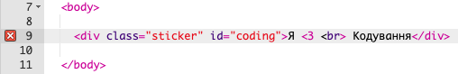

## Кольорова наклейка про кодування

Градієнт — це поступовий перехід від одного кольору до іншого. Градієнти можуть бути використані для створення крутих ефектів. Ти використовуватимеш їх для створення наклейок, які ти зможеш використати на своїх вебсторінках.

+ Відкрий цей проєкт trinket: <a href="http://jumpto.cc/web-stickers" target="_blank">jumpto.cc/web-stickers</a>.
    
    Проєкт повинен виглядати так:
    
    

+ Давай зробимо наклейку "Я <3 Кодування"g' sticker.
    
    Використовуй `
` з класом `sticker` та ідентифікатором `coding`, щоб для нього можна було додати стиль:
    
    

+ Хм, ти помітив (-ла), що в тебе виникла помилка? Це тому, що "<" є спеціальним символом у HTML. Замість "<" потрібно використовувати спеціальний код `&lt;`.
    
    Для виправлення помилки зміни свій код, щоб він використовував `&lt;`.
    
    
    
    ` ` створює новий рядок.

+ Тепер давай зробимо вигляд наклейки цікавішим.
    
    Перейди до файлу `style.css`. Ти побачиш, що він уже містить клас `.sticker `. Він задає розміщення наклейок на сторінці та вирівняє їх вміст по центру.
    
    Пам'ятай, що ти додав (-ла) ідентифікатор `coding` до своєї наклейки. Внизу `style.css` додай наступний код, щоб стилізувати текст:
    
    

+ Тепер ти можеш додати градієнт на тло наклейки. Лінійний градієнт змінює колір від одного до іншого вздовж прямої лінії.
    
    Цей градієнт змінюватиме колір від червоного у верхній частині до пурпурового у нижній. Додай код градієнта до стилю `coding`:
    
    

+ Ти можеш покращити результат, додавши відступ та скруглені кути.
    
    Додай виділений код:
    
    
    
    Цей стиль `padding` додає 50 пікселів у верхній і нижній частині та 30 пікселів ліворуч і праворуч.